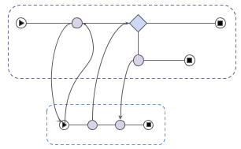
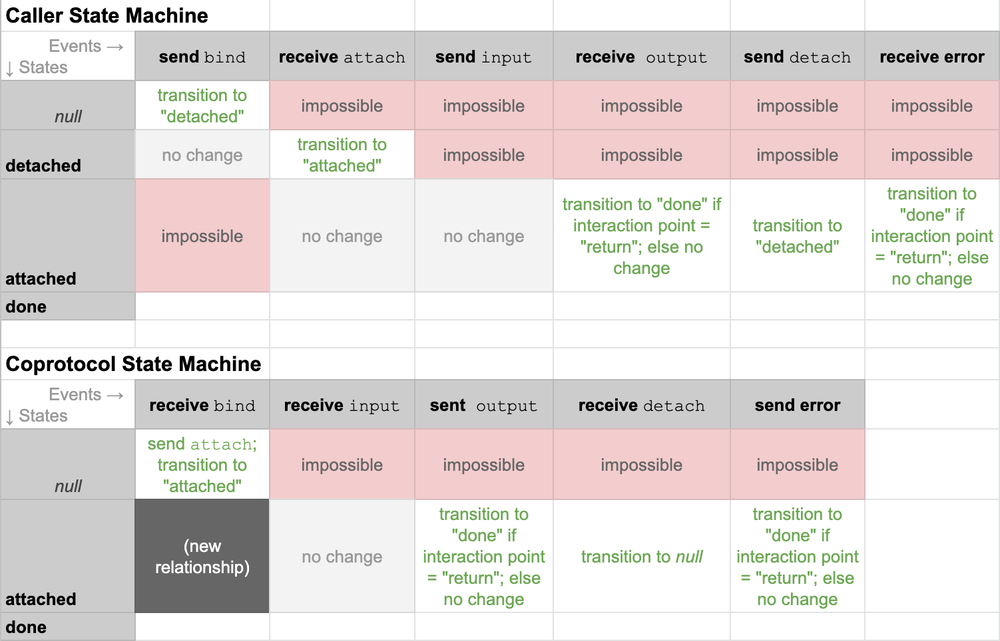

# Aries RFC 0482: Coprotocol Protocol 0.5
- Authors: [Daniel Hardman](daniel.hardman@gmail.com)
- Status: [STALLED](/README.md#stalled)
- Since: 2024-04-03
- Status Note: No implementations have been created.
- Start Date: 2020-02-03
- Tags: [feature](/tags.md#feature), [protocol](/tags.md#protocol)

[](https://j.mp/2XgyjH3)

## Summary

Allows [coprotocols](../../concepts/0478-coprotocols/README.md) to interact with one another.

## Motivation

We need a standard way for one protocol to invoke another, giving it input, getting its output, detaching, and debugging.

## Tutorial

### Name and Version

The name of this protocol is "Coprotocol Protocol 0.5" It is identified by the PIURI "https://didcomm.org/coprotocol/0.5".

### Key Concepts

Please make sure you are familiar with the general concept of coprotocols, as set forth in [Aries RFC 0478](../../concepts/0478-coprotocols/README.md). A working knowledge of the terminology and mental model explained there are foundational.

### Roles

The `caller` role is played by the entity giving input and getting output. The `called` is the entity getting input and giving output.

### States

The caller's normal state progression is `null` -> `detached` -> `attached` -> `done`. It is also possible to return to a `detached` state without ever reaching `done`.

The coprotocols normal state progression is `null` -> `attached` -> `done`.

[](https://docs.google.com/spreadsheets/d/1IgvdwMryC5us0Lb5AGzBYl_uGwf6Dt3cWx4jj9MXdTc/edit?usp=sharing)

### Messages

>Note: the discussion below is about how to launch and interact with *any* coprotocol. However, for concreteness we frame the walkthru in terms of a co-protocol that makes a payment. You can see an [example definition of such a coprotocol in RFC 0478](../../concepts/0478-coprotocols/README.md#example).

The protocol consists of 5 messages: `bind`, `attach`, `input`, `output`, `detach` and the adopted `problem-report` (for propagating errors).

The protocol begins with a `bind` message sent from `caller` to `called`. This message basically says, "I would like to interact with a new coprotocol instance having the following characteristics and the following mapping of identifiers to roles." It might look like this: 

```jsonc
{
    "@id": "4d116a88-1314-4af5-9b3c-848456b8b3dd",
    "@type": "https://didcomm.org/coprotocol/1.0/bind",
    "goal_code": "aries.buy.make-payment",
    "co_binding_id": null,
    "cast": [
        // Recipient of the bind message (id = null) should be payee.
        {"role": "payee", "id": null},
        // The payer will be did:peer:abc123.
        {"role": "payer", "id": "did:peer:abc123" }
    ]
}
```

When a `called` agent receives this message, it should discover what protocol implementations are available that match the criteria, and sort the candidates by preference. (Note that additional criteria can be added besides those shown here; see the [Reference section](#reference).) This could involve enumerating not-yet-loaded plugins. It could also involve negotiating a protocol with the remote party (e.g., the DID playing the role of `payer` in the example above) by querying its capabilities using the [Discover Features Protocol](../0031-discover-features/README.md). Of course, the capabilities of remote parties could also be cached to avoid this delay, or they could be predicted without confirmation, if circumstances suggest that's the best tradeoff. Once the candidates are sorted by preference, the best match should be selected. The coprotocol is NOT launched, but it is awaiting launch. The `called` agent should now generate an `attach` message that acknowledges the request to bind and tells the `caller` how to interact:

```jsonc
{
    "@id": "b3dd4d11-6a88-9b3c-4af5-848456b81314",
    "@type": "https://didcomm.org/coprotocol/1.0/attach",
    "~thread": { "pthid": "4d116a88-1314-4af5-9b3c-848456b8b3dd"},
    // This is the best match.
    "piuri": "https://didcomm.org/pay-with-venmo/1.3"
}
```

The `@id` of the `bind` message (also the `~thread.pthid` of the `attach` response) becomes a permanent identifier for the __coprotocol binding__. Both the caller and the coprotocol instance code can use it to lookup state as needed. The `caller` can now kick off/invoke the protocol with an `input` message:

```jsonc
{
    "@id": "56b81314-6a88-9b3c-4af5-b3dd4d118484",
    "@type": "https://didcomm.org/coprotocol/1.0/input",
    "~thread": { "pthid": "4d116a88-1314-4af5-9b3c-848456b8b3dd"},
    "interaction_point": "invoke",
    "data": [
        "amount": 1.23,
        "currency": "INR",
        "bill_of_sale": {
            // describes what's being purchased
        }
    ]
}
```

This allows the `caller` to invoke the bound coprotocol instance, and to pass it any number of named inputs.

Later, when the coprotocol instance wants to emit an output from `called` to `caller`, it uses an `output` message (in this case, one matching the `preauth` interaction point declared in the [sample coprotocol definition in RFC 0478](../../concepts/0478-coprotocols/README.md#example)):

```jsonc
{
    "@id": "9b3c56b8-6a88-f513-4a14-4d118484b3dd",
    "@type": "https://didcomm.org/coprotocol/1.0/output",
    "~thread": { "pthid": "4d116a88-1314-4af5-9b3c-848456b8b3dd"},
    "interaction_point": "preauth",
    "data": [
        "code": "6a884d11-13149b3c",
    ]
}
```

If a `caller` wants to detach, it uses a `detach` message. This leaves the coprotocol running on `called`; all inputs that it emits are sent to the bitbucket, and it advances on its normal state trajectory as if it were a wholly independent protocol:

```jsonc
{
    "@id": "7a3c56b8-5b88-d413-4a14-ca118484b3ee",
    "@type": "https://didcomm.org/coprotocol/1.0/detach",
    "~thread": { "pthid": "4d116a88-1314-4af5-9b3c-848456b8b3dd"}
}
```

A `caller` can re-attach by sending a new `bind` message; this time, the `co_binding_id` field should have the coprotocol binding id from the original `attach` message. Other fields in the message are optional; if present, they constitute a check that the binding in question has the properties the caller expects. The reattachment is confrimed by a new `attach` message.

## Reference

### `bind`
```jsonc
{
    "@id": "4d116a88-1314-4af5-9b3c-848456b8b3dd",
    "@type": "https://didcomm.org/coprotocol/1.0/bind",
    // I'd like to be bound to a coprotocol that achieves this goal.
    "goal_code": "aries.buy.make-payment",
    "co_binding_id": 
    // What is the intent about who plays which roles?
    "cast": [
        // Recipient of the bind message (id = null) should be payee.
        {"role": "payee", "id": null},
        // The payer will be did:peer:abc123.
        {"role": "payer", "id": "did:peer:abc123" }
    ],
    // Optional and preferably omitted as it creates tight coupling;
    // constrains bound coprotocol to just those that have a PIURI
    // matching this wildcarded expression. 
    "piuri_pat": "*/pay*",
    // If multiple matches are found, tells how to sort them to pick
    // best match. 
    "prefer": [
        // First prefer to bind a protocol that's often successful.
        { "attribute": "success_ratio", "direction": "d" },
        // Tie break by binding a protocol that's been run recently.
        { "attribute": "last_run_date", "direction": "d" },
        // Tie break by binding a protocol that's newer.
        { "attribute": "release_date", "direction": "d" }
        // Tie break by selecting protocols already running (false
        // sorts before true).
        { "attribute": "running", "direction": "d" }
    ]
}
```

### `attach`

```jsonc
{
    "@id": "b3dd4d11-6a88-9b3c-4af5-848456b81314",
    "@type": "https://didcomm.org/coprotocol/1.0/attach",
    "~thread": { "pthid": "4d116a88-1314-4af5-9b3c-848456b8b3dd"},
    // This is the best match.
    "piuri": "https://didcomm.org/pay-with-venmo/1.3",
    // Optional. Tells how long the caller has to take the next
    // step binding will be held in an
    // inactive state before being abandoned.
    "~timing.expires_time": "2020-06-23T18:42:07.124"
}
```

### Collateral

This section is optional. It could be used to reference files, code,
relevant standards, oracles, test suites, or other artifacts that would
be useful to an implementer. In general, collateral should be checked in
with the RFC.

## Drawbacks

Why should we *not* do this?

## Rationale and alternatives

- Why is this design the best in the space of possible designs?
- What other designs have been considered and what is the rationale for not
choosing them?
- What is the impact of not doing this?

## Prior art

Discuss prior art, both the good and the bad, in relation to this proposal.
A few examples of what this can include are:

- Does this feature exist in other SSI ecosystems and what experience have
their community had?
- For other teams: What lessons can we learn from other attempts?
- Papers: Are there any published papers or great posts that discuss this?
If you have some relevant papers to refer to, this can serve as a more detailed
theoretical background.

This section is intended to encourage you as an author to think about the
lessons from other implementers, provide readers of your proposal with a
fuller picture. If there is no prior art, that is fine - your ideas are
interesting to us whether they are brand new or if they are an adaptation
from other communities.

Note that while precedent set by other communities is some motivation, it
does not on its own motivate an enhancement proposal here. Please also take
into consideration that Aries sometimes intentionally diverges from common
identity features.

## Unresolved questions

- What parts of the design do you expect to resolve through the
enhancement proposal process before this gets merged?
- What parts of the design do you expect to resolve through the
implementation of this feature before stabilization?
- What related issues do you consider out of scope for this 
proposal that could be addressed in the future independently of the
solution that comes out of this doc?
   
## Implementations

> NOTE: This section should remain in the RFC as is on first release. Remove this note and leave the rest of the text as is. Template text in all other sections should be replace.

The following lists the implementations (if any) of this RFC. Please do a pull request to add your implementation. If the implementation is open source, include a link to the repo or to the implementation within the repo. Please be consistent in the "Name" field so that a mechanical processing of the RFCs can generate a list of all RFCs supported by an Aries implementation.

*Implementation Notes* [may need to include a link to test results](/README.md#accepted).

Name / Link | Implementation Notes
--- | ---
 | 

