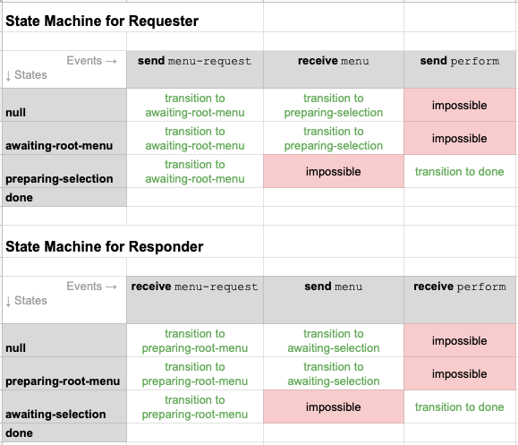

# Aries RFC 0509: Action Menu Protocol

- Authors: [Andrew Whitehead],[Stephen Curran],[John Court]
- Status: [DEMONSTRATED](/README.md#demonstrated)
- Since: 2020-07-02 
- Status Note: Implemented and demonstrated in the [Aries Cloud Agent Python](https://github.com/hyperledger/aries-cloudagent-python) code base 
- Supersedes: 
- Start Date: 2020-06-24
- Tags: [feature](/tags.md#feature), [protocol](/tags.md#protocol)
- Protocol Name: action-menu
- Version: 1.0
- URI: `https://didcomm.org/action-menu/%VER`


## Summary

The action-menu protocol allows one Agent to present a set of heirarchical menus and actions to another user-facing Agent in a human friendly way. The protocol allows limited service discovery as well as simple data entry. While less flexible than HTML forms or a chat bot, it should be relatively easy to implement and provides a user interface which can be adapted for various platforms, including mobile agents.

## Motivation

Discovery of a peer Agent's capabilities or service offerings is currently reliant on knowledge obtained out-of-band.  There is no in-band DIDComm supported protocol for querying a peer to obtain a human freindly menu of their capabilities or service offerings. Whilst this protocol doesn't offer ledger wide discovery capabilities, it will allow one User Agent connected to another, to present a navigable menu and request offered services. The protocol also provides an interface definition language to define action menu display, selection and request submission.

## Tutorial

### Name and Version

`action-menu`, version 1.0

### Key Concepts

The action-menu protocol requires an active DIDComm connection before it can proceed.  One Agent behaves as a `requester` in the protocol whilst the other Agent represents a `responder`.  Conceptually the `responder` presents a list of actions which can be initiated by the `requester`. Actions are contained within a menu structure. Individual Actions may result in traversal to another menu or initiation of other Aries protocols such as a presentation request, an introduction proposal, a credential offer, an acknowledgement, or a problem report. 

The protocol can be initiated by either the `requester` asking for the root menu or the `responder` sending an unsolicited root menu.  The protocol ends when the `requester` issues a `perform` operation or an internal timeout on the `responder` causes it to discard menu context.  At any time a `requester` can reset the protocol by requesting the root menu from a `responder`.

Whilst the protocol is defined here as uni-directional (i.e `requester` to `responder`), both Agents may support both `requester` and `responder` roles simultaneously. Such cases would result in two instances of the action-menu protocol operating in parrallel. 

### Roles

There are two roles in the action-menu protocol: `requester` and `responder`.

The `requester` asks the `responder` for menu definitions, presents them to a user, and initiates subsequent action items from the menu through further requests to the `responder`.

The `responder` presents an initial menu definition containing actionable elements to a `requestor` and then responds to subsequent action requests from the menu.  

### States

[](https://docs.google.com/spreadsheets/d/1KZ78KDxmXdck068aJpn-7BbDNfeaTcUyDgk6b2efCxc/edit?usp=sharing)

#### States for Requester

State&emsp;&emsp;&emsp;&emsp;&emsp;&emsp;&emsp;&emsp;| Description
------ | -----------
null | No _menu_ has been requested or received
awaiting-root-menu | _menu-request_ message has been sent and awaiting root _menu_ response
preparing-selection | _menu_ message has been received and a user selection is pending
done | _perform_ message has been sent and protocol has finished. Perform actions can include requesting a new menu which will re-enter the state machine with the receive-menu event from the null state.

#### States for Responder

State&emsp;&emsp;&emsp;&emsp;&emsp;&emsp;&emsp;&emsp;| Description
------ | -----------
null | No _menu_ has been requested or sent
preparing-root-menu | _menu-request_ message has been received and preparing _menu_ response for root menu
awaiting-selection | _menu_ message has been sent and are awaiting a _perform_ request
done | _perform_ message has been received and protocol has finished. Perform actions can include requesting a new menu which will re-enter the state machine with the send-menu event from the null state.

### Messages

#### menu

A `requestor` is expected to display only one active _menu_ per connection when action menus are employed by the `responder`. A newly received _menu_ is not expected to interrupt a user, but rather be made available for the user to inspect possible actions related to the `responder`.

```jsonc
{
  "@type": "https://didcomm.org/action-menu/%VER/menu",
  "@id": "5678876542344",
  "title": "Welcome to IIWBook",
  "description": "IIWBook facilitates connections between attendees by verifying attendance and distributing connection invitations.",
  "errormsg": "No IIWBook names were found.",
  "options": [
    {
      "name": "obtain-email-cred",
      "title": "Obtain a verified email credential",
      "description": "Connect with the BC email verification service to obtain a verified email credential"
    },
    {
      "name": "verify-email-cred",
      "title": "Verify your participation",
      "description": "Present a verified email credential to identify yourself"
    },
    {
      "name": "search-introductions",
      "title": "Search introductions",
      "description": "Your email address must be verified to perform a search",
      "disabled": true
    }
  ]
}
```
##### Description of attributes

* `title` -- plain text string, should be displayed at the top of the menu
* `description` -- plain text string, should be shown in smaller text below the title bar
* `errormsg` -- optional plain text string sent to indicate that the last _perform_ request did not work as expected. The text should be presented to the user in the title section
* `options` -- one or more available actions which the `responder` supports and may be requested in a _perform_ message.  
* `disabled` -- optional indication that an option is unavailable due to certain requirements not yet being met

##### Quick forms

Menu options may define a form property, which would direct the `requester` user to a client-generated form when the menu option is selected. The menu title should be shown at the top of the form, followed by the form description text if defined, followed by the list of form `params` in sequence. The form should also include a Cancel button to return to the menu, a Submit button (with an optional custom label defined by `submit-label`), and optionally a Clear button to reset the parameters to their default values.

```jsonc
{
  "@type": "https://didcomm.org/action-menu/%VER/menu",
  "@id": "5678876542347",
  "~thread": {
    "thid": "5678876542344"
  },
  "title": "Attendance Verified",
  "description": "",
  "options": [
    {
      "name": "submit-invitation",
      "title": "Submit an invitation",
      "description": "Send an invitation for IIWBook to share with another participant"
    },
    {
      "name": "search-introductions",
      "title": "Search introductions",
      "form": {
        "description": "Enter a participant name below to perform a search.",
        "params": [
          {
            "name": "query",
            "title": "Participant name",
            "default": "",
            "description": "",
            "required": true,
            "type": "text"
          }
        ],
        "submit-label": "Search"
      }
    }
  ]
}
```

When the form is submitted, a _perform_ message is generated containing values entered in the form. The `form` block may have an empty or missing `params` property in which case it acts as a simple confirmation dialog.

Each entry in the `params` list must define a `name` and `title`. The `description` is optional (should be displayed as help text below the field) and the `type` defaults to ‘text’ if not provided (only the ‘text’ type is supported at this time). Parameters should default to `required` true, if not specified. Parameters may also define a `default` value (used when rendering or clearing the form).


#### menu-request

In addition to menus being pushed by the `responder`, the root menu can be re-requested at any time by the `requestor` sending a _menu-request_.

```jsonc
{
  "@type": "https://didcomm.org/action-menu/%VER/menu-request",
  "@id": "5678876542345"
}
```

#### perform

When the `requestor` user actions a menu option, a _perform_ message is generated. It should be attached to the same thread as the _menu_. The active _menu_ should close when an option is selected.

The response to a _perform_ message can be any type of agent message, including another menu message, a presentation request, an introduction proposal, a credential offer, an acknowledgement, or a problem report. Whatever the message type, it should normally reference the same message thread as the perform message.

```jsonc
{
  "@type": "https://didcomm.org/action-menu/%VER/perform",
  "@id": "5678876542346",
  "~thread": {
    "thid": "5678876542344"
  },
  "name": "obtain-email-cred",
  "params": {}
}
```

##### Description of attributes

* `name` -- the _menu_ option being requested. This is taken from the `name` attribute of the `options` array elements in the _menu_  
* `params` -- optional dictionary containing any input parameters requested in a _menu_ option `form` section.  The dictionary key values are taken from the `name` attributes of `params` array elements in the _menu_ option `form`.

## Drawbacks

N/A 

## Rationale and alternatives

N/A 

## Prior art

There are several existing RFCs that relate to the general problem of "Discovery" 

* [Aries RFC 0031 : Discover Features Protocol 1.0](https://github.com/hyperledger/aries-rfcs/tree/master/features/0031-discover-features) -- This RFC provides _Aries Protocol_ discovery between two Agents but no direction on user interface display or action handling.
* [Aries RFC 0214 : "Help Me Discover" Protocol](https://github.com/hyperledger/aries-rfcs/tree/master/features/0214-help-me-discover) -- This RFC introduces the concept of a query language protocol between agents to obtain "referal" to a third agent. 

## Unresolved questions

- There needs to be some consideration around how the protocol may terminate due to `responder` side timeouts since maintaining menu context for connections consumes resources. Adoption of [Aries RFC 0035 : Report Problem Protocol 1.0](https://github.com/jcourt562/aries-rfcs/tree/action-menu/features/0035-report-problem)
is a viable solution

## Implementations

The following lists the implementations (if any) of this RFC. Please do a pull request to add your implementation. If the implementation is open source, include a link to the repo or to the implementation within the repo. Please be consistent in the "Name" field so that a mechanical processing of the RFCs can generate a list of all RFCs supported by an Aries implementation.

Name / Link | Implementation Notes
--- | ---
[Aries Cloud Agent - Python](https://github.com/hyperledger/aries-cloudagent-python) | [MISSING test results](/tags.md#test-anomaly)
