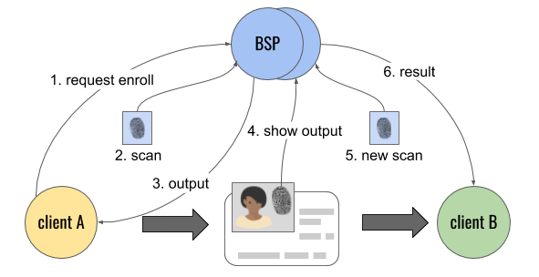

# Aries RFC 0528: Biometric Enrollment Protocol 0.9

- Authors: [Daniel Hardman](daniel.hardman@gmail.com)
- Status: [PROPOSED](/README.md#proposed)
- Since: 2020-08-19
- Status Note: Under review by community and biometrics experts. Builds on concepts in [RFC 0231: Biometric Service Provider](../../concepts/0231-biometric-service-provider/READMe.md). Sister protocol to [RFC 0529: Biometric Verification Protocol](../0529-biometric-verification-protocol/README.md)
- Start Date: 2020-08-19
- Tags: [feature](/tags.md#feature), [protocol](/tags.md#protocol), [biometrics](/tags.md#biometrics)

## Summary

Explains how a client of biometric services can enroll a person. Depending on protocol options, enrollment may or may not cause the biometric data to be saved, and may or may not enforce uniqueness. The protocol is vendor-neutral and usable with arbitrary biometric modalities (fingerprint, iris, hand geometry, gait, voice, face recognition, etc).

## Motivation

Biometrics offer significant value as a way to bind [verifiable credentials](https://www.w3.org/TR/vc-data-model/) to their authorized holder(s). They are also important for authentication and authorization use cases entirely independent from verifiable credentials. It's vital that [agents](../../concepts/0004-agents/README.md) in a [DIDComm](../../concepts/0005-didcomm/README.md)-based ecosystem be able to access biometrics as a tool. Defining an interoperable, modality-independent protocol for biometric enrollment is a first step. (The sister protocol to this one, specified in [RFC 0529: Biometric Verification Protocol](../0529-biometric-verification-protocol/README.md), is a logical complement. Together, these two protocols should address many needs.)  

## Tutorial

### Name and Version

The official name of this protocol is "Biometric Enrollment Protocol", and its version is 0.9. It is uniquely identified by the following [PIURI](../../concepts/0003-protocols/README.md#piuri):

>`https://didcomm.org/biometric_enrollment/0.9`

### Key Concepts

We assume you are comfortable with concepts such as __biometric service provider__ (__BSP__), __initial biometric vector__ (__IBV__), __candidate biometric vector__ (__CBV__), [liveness](https://www.intechopen.com/books/advanced-biometric-technologies/liveness-detection-in-biometrics), and the difference between 1:1 matching (where biometrics confirm a claimed identity) and 1:n matching (where biometrics identify the best match, if any, in a corpus). These are discussed in more detail in [RFC 0231: Biometric Service Provider](../../concepts/0231-biometric-service-provider/READMe.md).

#### Lifecycle
 
In its most general form, the lifecycle of biometric usage looks like this:

Here, steps 1-3 represent the enrollment part of the lifecycle, and are the focus of this RFC. Steps 4-6 represent the verification part of the lifecycle, and are the focus of the sister document, [RFC 0529: Biometric Verification Protocol](../0529-biometric-verification-protocol/README.md).

In this diagram, the fingerprint icon represents any modality of biometric. "Client A" and "client B" are systems or components that wish to use biometric features, and "BSP" is any component that provides those features. A canonical BSP would be an independent oracle that functions remotely and includes liveness detection, as described in [RFC 231](../../concepts/0231-biometric-service-provider/READMe.md); however, variations are conceivable. The divisions can be viewed as logical only; it's entirely possible that "client A" and "client B" are actually the same system, or even that the "BSP" component and either or both of its clients comprise the same system. And it's possible (though perhaps unusual) that the BSP involved in enrollment differs from the BSP involved in verification, as suggested by the doubled blue circles at the top. Separating the components allows us to clarify the different duties, privacy considerations, and data handling constraints that attend each one.

##### With Verifiable Credentials

In the world of verifiable credentials, "client A" would be an __issuer__, and "client B" would be a __verifier__. In the bottom center of the diagram is a credential containing biometric information; this would belong to a __holder__/__prover__. This is expected to be a key context for the protocol, but the protocol is relevant regardless of whether verifiable credentials are in play. 

#### Scenarios

The diagram presented above is deliberately generic, and so is the enrollment protocol. However, the intent of this flexibility, the semantics at play, and the expectations of each party will not be clear without comparing and contrasting some variants in deployment and in 1:1 versus 1:n matching.

##### Mostly Client-Local

We begin by imagining a deployment like the following:

Here, the BSP is remote from the client, but the individual and the biometric equipment are both local to the client. Only one comm channel exists, and it's between client and BSP. The client triggers data capture locally, and is thus responsible for the integrity of the captured data until it arrives at the BSP. The client can perform liveness verification on their own. The BSP's role is merely to transform the raw data from the capture device (received via the client) into a useful __output__. This output can be an __initial biometric vector__ (__IBV__) in a standard serialized format, or an arbitrary __enrollee identifier__ (__EI__), or both. The output is digitally signed by the BSP, certifying the BSP's involvement in its generation.

##### Maximum Self-Sovereignty

The theoretically ideal behavior from a privacy, cybersecurity, regulatory compliance, and interop perspective is for the BSP to NOT enforce uniqueness at enrollment, and to not store captured data in a database under BSP management. In such cases, the BSP simply transforms raw data transmitted by the client into an IBV output and returns it.

The client ALSO avoids storing the IBV, but instead embeds this data in a credential that's issued by the client and held by the individual. Because neither the BSP nor the client persist biometrics, neither constitutes a trove attractive to hackers or surveillance abuse, and neither has long-term data management responsibilities.

The individual can then present the credential to arbitrary verifiers (possibly using different a different BSP), and allow a comparison between a new biometric scan (producing a candidate biometric vector, CBV) and the IBV embedded in the credential to verify a match. If the verifier requires uniqueness, this can be accomplished by binding the holder to an additional credential that already has a uniqueness guarantee (e.g., a passport or driver's license).

A variation that's required by certain governments is to have the BSP enforce uniqueness. In such a case, the BSP uses the raw captured data to perform 1:n matching against the database of previously enrolled individuals. If a match is found, the BSP returns the enrollee identifier (EI) for the individual. If not, the BSP adds the new IBV to its database and returns the new EI. The EI is a lookup key indexed for convenient access of IBV records in the BSP database (arbitrary integer, uuid, etc). It should NOT be any form of PII; this would encumber the EI with regulatory and privacy issues. Usually, it should also NOT be a DID; this is an identifier under the control of the BSP, not the individual, and it doesn't need key rotation, endpoints, or other SSI-oriented metadata.

### Roles

There are 3 [parties](../../concepts/0003-protocols/roles-participants-etc.md#parties) to the enrollment protocol: `bsp`, `client`, and `individual`. However, only `bsp` and `client` exchange protocol messages and are therefore [participant](../../concepts/0003-protocols/roles-participants-etc.md#participants) roles. (The `individual` has a stake in the outcome, but they are not required to have an [agent](../../concepts/0004-agents/README.md) representing them. Therefore orchestrating their behavior and communicating with them is considered a matter of human processes that's out of scope for this protocol, with one minor exception noted below.)

### States

This section lists the possible states that exist for each role. It also
enumerates the events (often but not always messages) that can occur, including
errors, and what should happen to state as a result. A formal representation of
this information is provided in a _state machine matrix_. It lists events as
columns, and states as rows; a cell answers the question, "If I am in state X
(=row), and event Y (=column) occurs, what happens to my state?" The [Tic Tac
Toe example](https://github.com/hyperledger/aries-rfcs/blob/master/concepts/0003-protocols/tictactoe/README.md#states) is typical.

[Choreography Diagrams](
https://www.visual-paradigm.com/guide/bpmn/bpmn-orchestration-vs-choreography-vs-collaboration/#bpmn-choreography)
from [BPMN](http://www.bpmn.org/) are good artifacts here, as are [PUML sequence diagrams](
http://plantuml.com/sequence-diagram) and [UML-style state machine diagrams](http://agilemodeling.com/artifacts/stateMachineDiagram.htm).
The matrix form is nice because it forces an exhaustive analysis of every
possible event. The diagram styles are often simpler to create and consume,
and the PUML and BPMN forms have the virtue that they can support line-by-line
diffs when checked in with source code. However, they don't offer an
easy way to see if all possible flows have been considered; what they may
NOT describe isn't obvious. This--and the freedom from fancy tools--is why
the matrix form is used in many early RFCs. We leave it up to
the community to settle on whether it wants to strongly recommend specific
diagram types.

The formal names for each state are important, as they are used in [`ack`s](https://github.com/hyperledger/aries-rfcs/tree/master/features/0015-acks)
and [`problem-report`s](https://github.com/hyperledger/aries-rfcs/tree/master/features/0035-report-problem)).
For example, a `problem-report` message declares which state the sender
arrived at because of the problem. This helps other participants
to react to errors with confidence. Formal state names are also used in the
agent test suite, in log messages, and so forth.

By convention, state names use lower-kebab-case. They are compared
case-sensitively.

State management in protocols is a deep topic. For more information, please
see [State Details and State Machines](https://github.com/hyperledger/aries-rfcs/blob/master/concepts/0003-protocols/state-details.md).

### Messages

This section describes each message in the protocol. It should also note the names and
versions of messages from other message families that are adopted by the
protocol (e.g., an [`ack`](https://github.com/hyperledger/aries-rfcs/tree/master/features/0015-acks)
or a [`problem-report`](https://github.com/hyperledger/aries-rfcs/tree/master/features/0035-report-problem)).
Typically this section is written as a narrative, showing each message
type in the context of an end-to-end sample interaction. All possible
fields may not appear; an exhaustive catalog is saved for the "Reference"
section.

Sample messages that are presented in the narrative should also be checked
in next to the markdown of the RFC, in [DIDComm Plaintext format](
https://github.com/hyperledger/aries-rfcs/tree/master/features/0044-didcomm-file-and-mime-types#didcomm-messages-dm).

The _message_ element of a message type URI are typically lower_camel_case or lower-kebab-case, matching
the style of the protocol. JSON items in messages are lower_camel_case and inconsistency in the
application of a style within a message is frowned upon by the community.

#### Adopted Messages

Many protocols should use general-purpose messages such as [`ack`](
https://github.com/hyperledger/indy-hipe/pull/77) and [`problem-report`](
https://github.com/hyperledger/indy-hipe/pull/65)) at certain points in
an interaction. This reuse is strongly encouraged because it helps us avoid
defining redundant message types--and the code to handle them--over and
over again (see [DRY principle](https://en.wikipedia.org/wiki/Don't_repeat_yourself)).

However, using messages with generic values of `@type` (e.g., `"@type":
"https://didcomm.org/notification/1.0/ack"`)
introduces a challenge for agents as they route messages to their internal
routines for handling. We expect internal handlers to be organized around
protocols, since a protocol is a discrete unit of business value as well
as a unit of testing in our agent test suite. Early work on agents has
gravitated towards pluggable, routable protocols as a unit of code
encapsulation and dependency as well. Thus the natural routing question
inside an agent, when it sees a message, is "Which protocol handler should
I route this message to, based on its @type?" A generic `ack` can't be
routed this way.

Therefore, we allow a protocol to __adopt__ messages into its namespace.
This works very much like python's `from module import symbol` syntax.
It changes the `@type` attribute of the adopted message. Suppose a `rendezvous`
protocol is identified by the URI `https://didcomm.org/rendezvous/2.0`,
and its definition announces that it has adopted generic 1.x `ack`
messages. When such `ack` messages are sent, the `@type` should now use
the alias defined inside the namespace of the `rendezvous` protocol:

Adoption should be declared in an "Adopted" subsection of "Messages".
When adoption is specified, it should include a __minimum
adopted version__ of the adopted message type: "This protocol adopts
`ack` with version >= 1.4". All versions of the adopted message that share
the same major number should be compatible, given the [semver rules](concepts/0003-protocols/semver.md)
that apply to protocols.

### Constraints

Many protocols have constraints that help parties build trust.
For example, in buying a house, the protocol includes such things as
commission paid to realtors to guarantee their incentives, title insurance,
earnest money, and a phase of the process where a home inspection takes
place. If you are documenting a protocol that has attributes like
these, explain them here. If not, the section can be omitted.

## Reference

All of the sections of reference are optional. If none are needed, the
"Reference" section can be deleted.

### Messages Details

Unless the "Messages" section under "Tutorial" covered everything that
needs to be known about all message fields, this is where the data type,
validation rules, and semantics of each field in each message type are
details. Enumerating possible values, or providing ABNF or regexes is
encouraged. Following conventions such as [those for date-
and time-related fields](https://github.com/hyperledger/aries-rfcs/tree/master/concepts/0074-didcomm-best-practices#date-time-conventions)
can save a lot of time here.

Each message type should be associated with one or more roles in the 
protocol. That is, it should be clear which roles can send and receive
which message types.

If the "Tutorial" section covers everything about the messages, this
section should be deleted.

### Examples

This section is optional. It can be used to show alternate flows through
the protocol.

### Collateral

This section is optional. It could be used to reference files, code,
relevant standards, oracles, test suites, or other artifacts that would
be useful to an implementer. In general, collateral should be checked in
with the RFC.

### Localization

If communication in the protocol involves humans, then localization of
message content may be relevant. Default settings for localization of
all messages in the protocol can be specified in an `l10n.json` file
described here and checked in with the RFC. See ["Decorators at Message
Type Scope"](https://github.com/hyperledger/aries-rfcs/tree/master/concepts/0011-decorators#decorator-scope)
in the [Localization RFC](https://github.com/hyperledger/aries-rfcs/tree/master/features/0043-l10n).

### Codes Catalog

If the protocol has a formally defined catalog of codes (e.g., for errors
or for statuses), define them in this section. See ["Message Codes and
Catalogs"](https://github.com/hyperledger/aries-rfcs/blob/master/features/0043-l10n/README.md#message-codes-and-catalogs)
in the [Localization RFC](https://github.com/hyperledger/aries-rfcs/blob/master/features/0043-l10n).

## Drawbacks

Why should we *not* do this?

## Rationale and alternatives

- Why is this design the best in the space of possible designs?
- What other designs have been considered and what is the rationale for not
choosing them?
- What is the impact of not doing this?

## Prior art

Discuss prior art, both the good and the bad, in relation to this proposal.
A few examples of what this can include are:

- Does this feature exist in other SSI ecosystems and what experience have
their community had?
- For other teams: What lessons can we learn from other attempts?
- Papers: Are there any published papers or great posts that discuss this?
If you have some relevant papers to refer to, this can serve as a more detailed
theoretical background.

This section is intended to encourage you as an author to think about the
lessons from other implementers, provide readers of your proposal with a
fuller picture. If there is no prior art, that is fine - your ideas are
interesting to us whether they are brand new or if they are an adaptation
from other communities.

Note that while precedent set by other communities is some motivation, it
does not on its own motivate an enhancement proposal here. Please also take
into consideration that Aries sometimes intentionally diverges from common
identity features.

## Unresolved questions

- What parts of the design do you expect to resolve through the
enhancement proposal process before this gets merged?
- What parts of the design do you expect to resolve through the
implementation of this feature before stabilization?
- What related issues do you consider out of scope for this 
proposal that could be addressed in the future independently of the
solution that comes out of this doc?

## Implementations

> NOTE: This section should remain in the RFC as is on first release. Remove this note and leave the rest of the text as is. Template text in all other sections should be removed before submitting your Pull Request.

The following lists the implementations (if any) of this RFC. Please do a pull request to add your implementation. If the implementation is open source, include a link to the repo or to the implementation within the repo. Please be consistent in the "Name" field so that a mechanical processing of the RFCs can generate a list of all RFCs supported by an Aries implementation.

*Implementation Notes* [may need to include a link to test results](README.md#accepted).

Name / Link | Implementation Notes
--- | ---
 |
