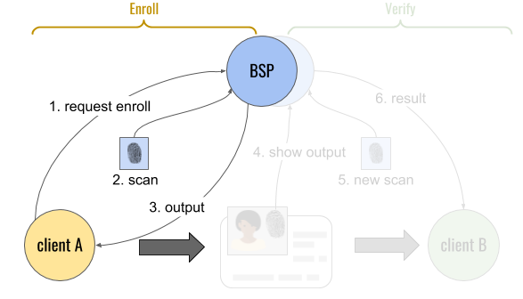
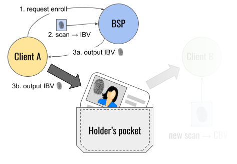
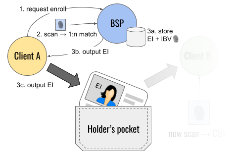
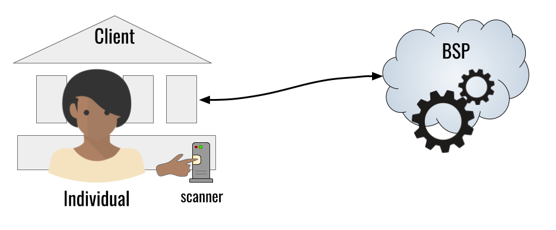
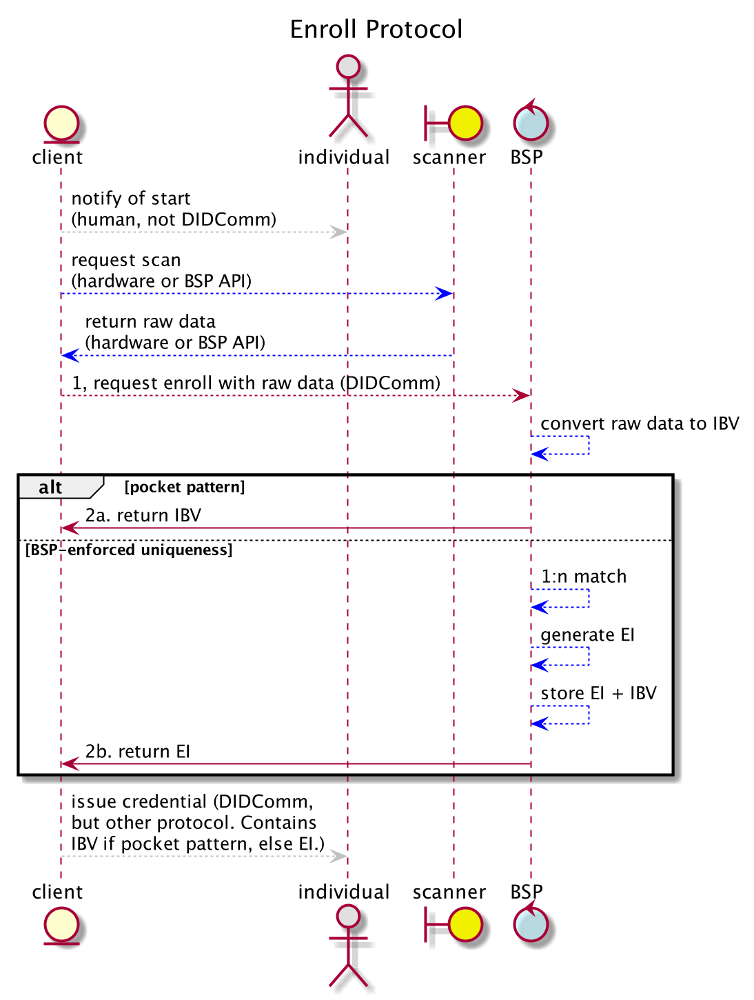

# Aries RFC 0528: Biometric Enrollment Protocol 0.9

- Authors: [Daniel Hardman](daniel.hardman@gmail.com), [Tiara Johnson](tiaramary@gmail.com)
- Status: [PROPOSED](/README.md#proposed)
- Since: 2020-08-19
- Status Note: Under review by community and biometrics experts. Builds on concepts in [RFC 0231: Biometric Service Provider](../../concepts/0231-biometric-service-provider/READMe.md). Sister protocol to [RFC 0529: Biometric Verification Protocol](../0529-biometric-verification-protocol/README.md)
- Start Date: 2020-08-19
- Tags: [feature](/tags.md#feature), [protocol](/tags.md#protocol), [biometrics](/tags.md#biometrics)

## Summary

Explains how a client of biometric services can enroll a person. Depending on protocol options, enrollment may or may not cause the biometric data to be saved, and may or may not enforce uniqueness. The protocol is vendor-neutral and usable with arbitrary biometric modalities (fingerprint, iris, hand geometry, gait, voice, face recognition, etc). The protocol described here is likely to be implemented by calling lower-level protocols supplied by individual vendors of biometric technology; this is a standard wrapper that provides all the security and privacy guarantees of DIDComm.

## Motivation

Biometrics offer significant value as a way to bind [verifiable credentials](https://www.w3.org/TR/vc-data-model/) to their authorized holder(s). They are also important for authentication and authorization use cases entirely independent from verifiable credentials. It's vital that [agents](../../concepts/0004-agents/README.md) in a [DIDComm](../../concepts/0005-didcomm/README.md)-based ecosystem be able to access biometrics as a tool. Defining an interoperable, modality-independent protocol for biometric enrollment is a first step. (The sister protocol to this one, specified in [RFC 0529: Biometric Verification Protocol](../0529-biometric-verification-protocol/README.md), is a logical complement. Together, these two protocols should address many needs.)  

## Tutorial

### Name and Version

The official name of this protocol is "Biometric Enrollment Protocol", and its version is 0.9. It is uniquely identified by the following [PIURI](../../concepts/0003-protocols/README.md#piuri):

>`https://didcomm.org/biometric_enrollment/0.9`

### Key Concepts

We assume you are comfortable with concepts such as __biometric service provider__ (__BSP__), __initial biometric vector__ (__IBV__), __candidate biometric vector__ (__CBV__), [liveness](https://www.intechopen.com/books/advanced-biometric-technologies/liveness-detection-in-biometrics), and the difference between 1:1 matching (where biometrics confirm a claimed identity) and 1:n matching (where biometrics identify the best match, if any, in a corpus). These are discussed in more detail in [RFC 0231: Biometric Service Provider](../../concepts/0231-biometric-service-provider/READMe.md).

#### Lifecycle
 
In its most general form, the lifecycle of biometric usage looks like this:

Here, lifecycle steps 1-3 represent the enrollment part of the lifecycle, and are the focus of this RFC. Steps 4-6 represent the verification part of the lifecycle, and are the focus of the sister document, [RFC 0529: Biometric Verification Protocol](../0529-biometric-verification-protocol/README.md).

In this diagram, the fingerprint icon is just a familiar placeholder for any modality of biometric. "Client A" and "client B" are systems or components that wish to use biometric features, and "BSP" is any component that provides those features. A canonical BSP would be an independent oracle that functions remotely and includes liveness detection, as described in [RFC 231](../../concepts/0231-biometric-service-provider/READMe.md); however, variations are conceivable. The divisions can be viewed as logical only; it's entirely possible that "client A" and "client B" are actually the same system, or even that the "BSP" component and either or both of its clients comprise the same system. And it's possible (though perhaps unusual) that the BSP involved in enrollment differs from the BSP involved in verification, as suggested by the doubled blue circles at the top. Separating the components allows us to clarify the different duties, privacy considerations, and data handling constraints that attend each one.

>##### Note: Application to Verifiable Credentials
>In the world of verifiable credentials, "client A" would be an __issuer__, and "client B" would be a __verifier__. In the bottom center of the diagram is a credential containing biometric information; this would belong to a __holder__/__prover__. This is expected to be a key context for the protocol, but the protocol is relevant regardless of whether verifiable credentials are in play. 

#### Pocket Pattern

The theoretically ideal behavior from a privacy, cybersecurity, regulatory compliance, and interop perspective is for the BSP to NOT enforce uniqueness at enrollment, and to not store captured data in a database under BSP management. In such cases, the BSP simply transforms raw data transmitted by the client into an IBV output and returns it.

The client ALSO avoids storing the IBV, but instead embeds this data in a credential that's issued by the client and held by the individual. Because neither the BSP nor the client persist biometrics, neither constitutes a trove attractive to hackers or surveillance abuse, and neither has long-term data management responsibilities.

The individual can then present the credential to arbitrary verifiers (possibly using a different BSP), and allow a comparison between a new biometric scan (producing a candidate biometric vector, CBV) and the IBV embedded in the credential to verify a match. If the verifier requires uniqueness, this can be accomplished by binding the holder to an additional credential that already has a uniqueness guarantee (e.g., a passport or driver's license). This style of deployment is known as the __pocket pattern__, because it resembles how data is managed when a biometric is held on a physical ID in a person's pocket.

#### BSP-Enforced Uniqueness Pattern

A variation is to have the BSP enforce uniqueness. In such a case, the BSP uses the raw captured data to perform 1:n matching against the database of previously enrolled individuals. If a match is found, the BSP returns the __enrollee identifier__ (__EI__) for the individual. If not, the BSP adds the new IBV to its database and returns the new EI. The EI is a lookup key indexed for convenient access of IBV records in the BSP database (arbitrary integer, uuid, etc). It should NOT be any form of PII; this would encumber the EI with regulatory and privacy issues. Usually, it should also NOT be a DID; this is an identifier under the control of the BSP, not the individual, and it doesn't need key rotation, endpoints, or other SSI-oriented metadata.

This approach is somewhat more centralized than the pocket pattern, and thus places greater trust in the BSP. Its advantage is that it enforces uniqueness directly, and it satisfies certain regulatory requirements.

#### Remoteness

The diagrams presented above are deliberately generic, and so is the enrollment protocol. However, the intent of this flexibility, the semantics at play, and the expectations of each party will not be clear without comparing and contrasting some variants in deployment. This is because remoteness introduces trust complications.

##### Mostly Client-Local

We begin by imagining a deployment like the following:

Here, the BSP is remote from the client, but the individual and the biometric equipment are both local to the client. Only one comm channel exists, and it's between client and BSP. The client triggers data capture locally, and is thus responsible for the integrity of the captured data until it arrives at the BSP. The client can perform liveness verification on their own. The BSP's role is merely to transform the raw data from the capture device (received via the client) into a useful __output__. This output can be an __initial biometric vector__ (__IBV__) in a standard serialized format, or an arbitrary __enrollee identifier__ (__EI__), or both. The output is digitally signed by the BSP, certifying the BSP's involvement in its generation.

##### Other Deployment Choices

TODO: talk about a case where the individual and scanner are colocated with BSP, or where the individual and scanner are neither at the BSP nor at the client.

### Roles

There are 3 [parties](../../concepts/0003-protocols/roles-participants-etc.md#parties) to the enrollment protocol: `bsp`, `client`, and `individual`. However, only `bsp` and `client` exchange protocol messages and are therefore [participant](../../concepts/0003-protocols/roles-participants-etc.md#participants) roles. (The `individual` has a stake in the outcome, but they are not required to have an [agent](../../concepts/0004-agents/README.md) representing them. Therefore orchestrating their behavior and communicating with them is considered a matter of human processes that's out of scope for the DIDComm-level protocol, with one minor exception noted below.)

### States

TODO

### Messages

#### Adopted Messages

### Constraints

## Reference

### Messages Details

### Examples

### Collateral

### Localization

### Codes Catalog

## Drawbacks

## Rationale and alternatives

## Prior art

## Unresolved questions

## Implementations

> NOTE: This section should remain in the RFC as is on first release. Remove this note and leave the rest of the text as is. Template text in all other sections should be removed before submitting your Pull Request.

The following lists the implementations (if any) of this RFC. Please do a pull request to add your implementation. If the implementation is open source, include a link to the repo or to the implementation within the repo. Please be consistent in the "Name" field so that a mechanical processing of the RFCs can generate a list of all RFCs supported by an Aries implementation.

*Implementation Notes* [may need to include a link to test results](README.md#accepted).

Name / Link | Implementation Notes
--- | ---
 |
