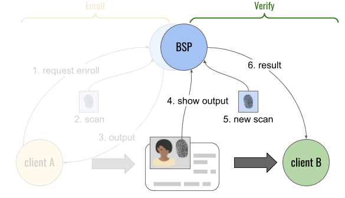
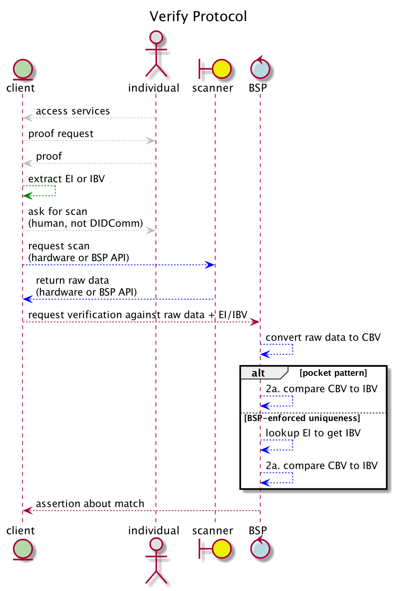

# Aries RFC 0528: Biometric Verification Protocol 0.9

- Authors: [Daniel Hardman](daniel.hardman@gmail.com)
- Status: [PROPOSED](/README.md#proposed)
- Since: 2020-08-19
- Status Note: Under review by community and biometrics experts. Builds on concepts in [RFC 0231: Biometric Service Provider](../../concepts/0231-biometric-service-provider/READMe.md). Sister protocol to [RFC 0528: Biometric Enrollment Protocol](../0528-biometric-enrollment-protocol/README.md)
- Start Date: 2020-08-19
- Tags: [feature](/tags.md#feature), [protocol](/tags.md#protocol), [biometrics](/tags.md#biometrics)

## Summary

Explains how a client of biometric services can verify a person. Depending on protocol options, verification may expect saved data in different places. The protocol is vendor-neutral and usable with arbitrary biometric modalities (fingerprint, iris, hand geometry, gait, voice, face recognition, etc).

## Motivation

Biometrics offer significant value as a way to bind [verifiable credentials](https://www.w3.org/TR/vc-data-model/) to their authorized holder(s). They are also important for authentication and authorization use cases entirely independent from verifiable credentials. It's vital that [agents](../../concepts/0004-agents/README.md) in a [DIDComm](../../concepts/0005-didcomm/README.md)-based ecosystem be able to access biometrics as a tool. Defining an interoperable, modality-independent protocol for biometric verification is a second step. (The sister protocol to this one, specified in [RFC 0528: Biometric Enrollment Protocol](../0528-biometric-enrollment-protocol/README.md), is a first step and logical complement. Together, these two protocols should address many needs.)  

## Tutorial

### Name and Version

The official name of this protocol is "Biometric Verification Protocol", and its version is 0.9. It is uniquely identified by the following [PIURI](../../concepts/0003-protocols/README.md#piuri):

>`https://didcomm.org/biometric_verification/0.9`

### Key Concepts

We assume you are comfortable with concepts such as __biometric service provider__ (__BSP__), __initial biometric vector__ (__IBV__), __candidate biometric vector__ (__CBV__), [liveness](https://www.intechopen.com/books/advanced-biometric-technologies/liveness-detection-in-biometrics), and the difference between 1:1 matching (where biometrics confirm a claimed identity) and 1:n matching (where biometrics identify the best match, if any, in a corpus). These are discussed in more detail in [RFC 0231: Biometric Service Provider](../../concepts/0231-biometric-service-provider/READMe.md).

#### Lifecycle
 
In its most general form, the lifecycle of biometric usage looks like this:

Here, lifecycle steps 1-3 represent the enrollment part of the lifecycle, and are the focus of the sister document, [RFC 0528: Biometric Enrollment Protocol](../0528-biometric-enrollment-protocol/README.md). Steps 4-6 represent the verification part of the lifecycle, and are the focus of this RFC.

In this diagram, the fingerprint icon is just a familiar placeholder for any modality of biometric. "Client A" and "client B" are systems or components that wish to use biometric features, and "BSP" is any component that provides those features. A canonical BSP would be an independent oracle that functions remotely and includes liveness detection, as described in [RFC 231](../../concepts/0231-biometric-service-provider/READMe.md); however, variations are conceivable. The divisions can be viewed as logical only; it's entirely possible that "client A" and "client B" are actually the same system, or even that the "BSP" component and either or both of its clients comprise the same system. And it's possible (though perhaps unusual) that the BSP involved in enrollment differs from the BSP involved in verification, as suggested by the doubled blue circles at the top. Separating the components allows us to clarify the different duties, privacy considerations, and data handling constraints that attend each one.

>##### Note: Application to Verifiable Credentials
>In the world of verifiable credentials, "client A" would be an __issuer__, and "client B" would be a __verifier__. In the bottom center of the diagram is a credential containing biometric information; this would belong to a __holder__/__prover__. This is expected to be a key context for the protocol, but the protocol is relevant regardless of whether verifiable credentials are in play. 

### Roles

### States

### Messages

#### Adopted Messages

### Constraints

## Reference

### Messages Details

### Examples

### Collateral

### Localization

### Codes Catalog

## Drawbacks

## Rationale and alternatives

## Prior art

## Unresolved questions

## Implementations

> NOTE: This section should remain in the RFC as is on first release. Remove this note and leave the rest of the text as is. Template text in all other sections should be removed before submitting your Pull Request.

The following lists the implementations (if any) of this RFC. Please do a pull request to add your implementation. If the implementation is open source, include a link to the repo or to the implementation within the repo. Please be consistent in the "Name" field so that a mechanical processing of the RFCs can generate a list of all RFCs supported by an Aries implementation.

*Implementation Notes* [may need to include a link to test results](README.md#accepted).

Name / Link | Implementation Notes
--- | ---
 |
