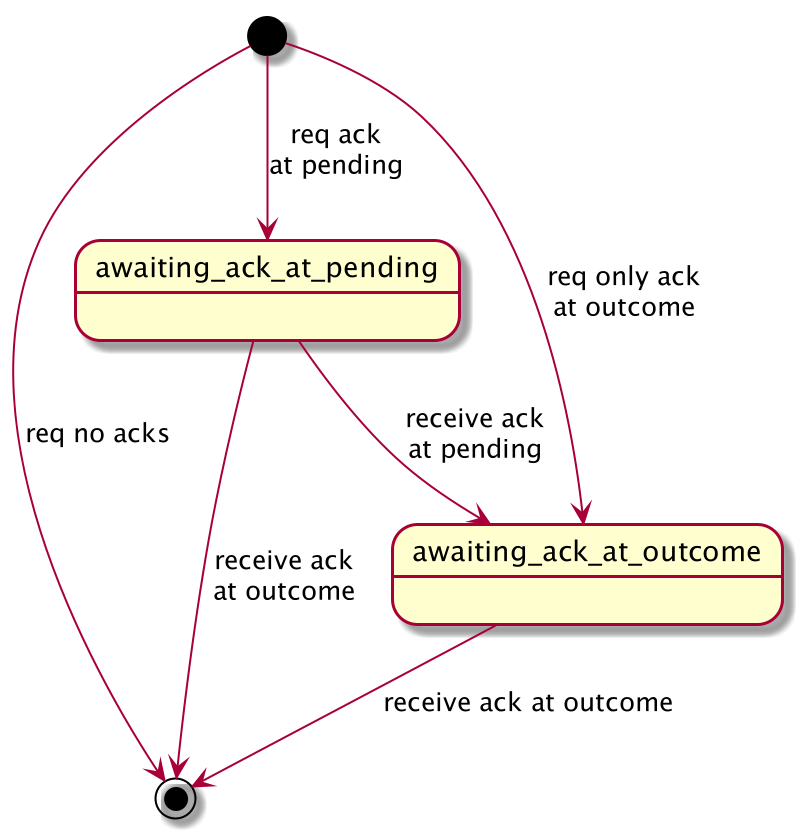
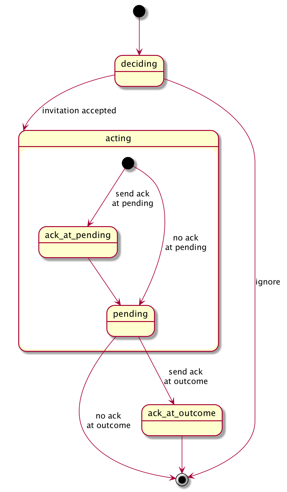

# Aries RFC 0547: Invite Action Protocol

- Authors: [Daniel Hardman](daniel.hardman@gmail.com)
- Status: [PROPOSED](/README.md#proposed)
- Since: 2020-09-30
- Status Note: newly submitted for community consideration, based on a use case developed by the credit union industry in the United States. Implements a concept first called "please play a role" that was discussed on community calls in mid 2020 in conjunction with the [Out of Band protocol](../0434-outofband/README.md).
- Start Date: 2020-09-30
- Tags: [feature](/tags.md#feature), [protocol](/tags.md#protocol)
- URI: https://didcomm.org/invite-action/%VER 

## Summary

Provides a mechanism for one [agent](../../concepts/0004-agents/README.md) to invite another to take a particular action. The action is described in a way that can be automated. It may be accompanied by supporting data. The invited agent may or may not trust the inviter, and may choose to react in various ways -- ignore the invitation, accept it, defer a decision, etc.

## Motivation

DIDComm protocols often make a strong assumption about who is the "first mover" -- the role that must emit the protocol's initial message. For example, in [RFC 0193: Coin Flip Protocol](../0193-coin-flip/README.md), the `recorder` always begins by saying, in essence, "Let's flip a coin. I'll toss and you call." There is no option to say, "Let's flip a coin. You toss and I'll call." The `recorder` role always starts.

Human interactions are more flexible: when we want someone else to take the first step, we can simply ask them to do so: "We should do lunch sometime. Why don't you send me an appointment?"

In the DIDComm ecosystem, we want automated, software-driven interactions to have the potential for this same flexibility. Suppose Alice is a recruiter who identifies Bob as a match for a job she's trying to fill. If an `apply-for-job` protocol says the `applicant` must make the first move, how can Alice invite Bob to start the interaction? Certainly, she can have a flexible human conversation. But what if Alice is managing thousands of job openings and prospective applicants, and she wants to use her agent to get work done at scale, driven by automation and policy? And what if Bob wants to sort such invitations into "spam" and "worth reading" buckets using automated policies of his own? How can agents achieve the same flexiblity without depending on humans?

One answer is to modify each protocol to allow multiple parties to initiate. This strategy is used in [RFC 0036: Issue Credential Protocol](../0036-issue-credential/README.md), for example, where either the `issuer` can offer or the prospective `holder` can request. It could be used to modify an `apply-for-job` protocol so recruiters can reach out to applicants.

Sometimes this answer may be appropriate. However, one issue with it as a general strategy is that it requires extra logic built into every protocol handler, even though the inversion of normal ordering is pretty formulaic. In other words, it creates lots of boilerplate rather than a reusable, composable mechanism.

Another issue is that we also want agents to be able to suggest actions to one another that may not be DIDComm protocols at all. Alice is driving beside a car that appears to have a flat; she wants to suggest to the car (if it's self-driving) or to the driver (if it's a more traditional vehicle) that it might be a good idea to inspect the tire. Either way, this will involve sending a message to some sort of agent, inviting an "inspect the tire" action. But inspecting tires is not a protocol to which Alice is party; it may not be a protocol at all. Alice doesn't care; she just wants to suggest the action.
 
#### Existing Mechanisms

 The community has addressed subsets of these use cases in other ways. Comparing Invite Action to these other mechanism may make the motivation of this new RFC clearer:
   
mechanism | what's alike, what's different
----------|-----------------
Basic Message Protocol | Lets humans invite one another to take arbitrary actions, but requires human intelligence for decision-making. Arbitrary attachments &mdash; available in all DIDComm contexts &mdash; can carry machine-actionable payloads, but the history of email demonstrates that it's unsafe to trigger machine actions based on attachments without predefined semantics. Also, the mime type of an attachment does not necessarily indicate which action is desired (is an attached PDF supposed to be saved, printed, displayed to the user...). And there's no useful way to separate messages intended for human interpretation from messages that automation should handle.   
Out of Band Protocol (RFC 434) | Like Invite Action, OOB lets the sender propose to the receiver that the receiver take an action &mdash; and automation can be built on the receiving side, because the action is described with a formal goal code. However, OOB is for situations where no channel is known to exist between two parties, and it always involves transmitting a message over a non-DIDComm channel. OOB assumes that either a handshake protocol or `~request-attach` is relevant; it doesn't allow a goal code to be sent in isolation. Only Invite Action supports actions that are not protocols in the DIDComm sense.
Co-protocol Protocol (RFC 0482) | Allows an agent to trigger or attach to a subactivity or side activity of some sort. However, it assumes that this other activity is a DIDComm protocol, and that the two agents that participate have a relationship of trust. Invite Action does not assume trust between agents, and does not assume that the party doing the inviting has a stake in ongoing communication about the action.
Action Menu (RFC 0509) | Allows one agent to trigger an action in another. However, this requires a round trip; the requester asks for a menu from the responder, and then selects an item to be performed. If Action Menu were revised to support goal codes and if it supported a short-circuit whereby there didn't need to be a round trip, and if Action Menu supported the advanced form of `~please_ack`, these protocols might be collapsible

## Tutorial

### Name and Version

The official name of the protocol is "Invite Action"; its official version is 0.9. This is reflected in its [PIURI](../../concepts/0003-protocols/README.md#piuri):

>`https://didcomm.org/invite-action/0.9`

### Key Concepts

This protocol approximates the flow of a classic two-message request-response protocol, except that two responses are possible rather than one, and both responses are optional.

### Roles

The protocol has two roles: `inviter` and `invitee`.

### States

The `inviter` sends a message inviting the `invitee` to take an action. The message may include an advanced [`~please_ack` decorator](../0317-please-ack/README.md) that invites [ACKs](../0317-please-ack/README.md#advanced-features-experimental) to be sent back from `invitee` to `inviter`, either at the time the invitation is accepted or at the time out outcome for the action is known, or both.

The `inviter` state machine looks like this:

[](inviter_states.puml)

The `invitee` state machine looks like this:

[](invitee_states.puml)


### Messages

The first message in the protocol (the only message that's required) is sent from `inviter` to `invitee`. An example might look like this:

```jsonc
{
  "@id": "a3079284-9eed-4c76-8d39-a01c797b0e93",
  "@type": "https://didcomm.org/invite-action/invite",
  "goal_code": "automotive.inspect.tire",
  "please_ack": {
    "on": ["ACCEPT", "OUTCOME"]
  }
}
```

This message suggests that the `invitee` take an action described by the [goal code](../../concepts/0519-goal-codes/README.md) `automotive.inspect.tire`, and asks the `invitee` to send back an ACK when the message is received, and another when the outcome of the action is known. 

#### Adopted Messages

The generic [ACK](../0015-acks/README.md) message, version 1.0, is adopted into this protocol. This means the type of ACKs in this protocol should be:

>`https://didcomm.org/invite-action/%VER/ack`

## Reference

### Messages Details

The only unique field of an `invite` message is `goal_code`. The semantics of goal codes are described in [RFC 0519]. The `~please_ack` decorator is not required, but if present, it matches the semantics described in the [advanced section of RFC 0317](../0317-please-ack/README.md#advanced-features-experimental).

Some general-purpose mechanisms can also enrich this message:

* The `~timing.expires_time` decorator can be used to constrain how long the `inviter` will wait for an ACK.
* Individual goal codes can specify that they are to be accompanied by specific attachments. Then the generic DIDComm attachment mechanism can be used to pass data to the `invitee`.


## Drawbacks

Why should we *not* do this?

## Rationale and alternatives

- Why is this design the best in the space of possible designs?
- What other designs have been considered and what is the rationale for not
choosing them?
- What is the impact of not doing this?

## Prior art

See [Motivation](#motivation), which explains how this mechanism differs from some similar tools that are already available in the DIDComm ecosystem.

## Unresolved questions

- How will we integrate this mechanism with the rules of a governance framework?

## Implementations

> NOTE: This section should remain in the RFC as is on first release. Remove this note and leave the rest of the text as is. Template text in all other sections should be removed before submitting your Pull Request.

The following lists the implementations (if any) of this RFC. Please do a pull request to add your implementation. If the implementation is open source, include a link to the repo or to the implementation within the repo. Please be consistent in the "Name" field so that a mechanical processing of the RFCs can generate a list of all RFCs supported by an Aries implementation.

*Implementation Notes* [may need to include a link to test results](/README.md#accepted).

Name / Link | Implementation Notes
--- | ---
 |
