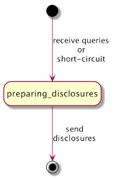

# Aries RFC 0557: Discover Features Protocol v2.x

- Authors: Daniel Hardman
- Status: [PROPOSED](/README.md#proposed)
- Since: 2020-10-15
- Status Note: Update to version 2.0 proposed in conjunction with DIDComm v2 efforts at DIF, where it became clear that we need to discover more than just protocol support of other agents.
- Supersedes: [version 1.0 of this protocol in RFC 0031](../0031-discover-features/README.md), which was widely referenced in the Aries eocsystem in 2018 and 2019.
- Start Date: 2018-12-17
- URI: https://didcomm.org/discover-features/%VER
- Tags: [feature](/tags.md#feature), [protocol](/tags.md#protocol), [test-anomaly](/tags.md#test-anomaly)

## Summary

Describes how one agent can query another to discover which features it supports, and to what extent.

## Motivation

Though some agents will support just one feature and will be statically configured to interact with just one other party, many exciting uses of agents are more dynamic and unpredictable. When Alice and Bob meet, they won't know in advance which features are supported by one another's agents. They need a way to find out.

## Tutorial

This is version 2.0 of the Discover Features protocol, and its fully qualified [PIURI](../../concepts/0003-protocols/README.md#piuri) for the Discover Features protocol is:

    https://didcomm.org/discover-features/2.0
    
This version is conceptually similar to [version 1.0 of this protocol](../0031-discover-features/README.md). It differs in its ability to ask about multiple feature types, and to ask multiple questions and receive multiple answers in a single round trip.

### Roles

There are two roles in the `discover-features` protocol: `requester` and `responder`. Normally, the requester asks the responder about the features it supports, and the responder answers. Each role uses a single message type.

It is also possible to proactively disclose features; in this case a requester receives a response without asking for it. This may eliminate some chattiness in certain use cases (e.g., where two-way connectivity is limited).

### States

The state progression is very simple. In the normal case, it is simple request-response; in a proactive disclosure, it's a simple one-way notification.

#### Requester


#### Responder


### Messages

##### `queries` Message Type

A `discover-features/queries` message looks like this:

```jsonc
{
  "@type": "https://didcomm.org/discover-features/2.0/queries",
  "@id": "yWd8wfYzhmuXX3hmLNaV5bVbAjbWaU",
  "queries": [
    { "feature-type": "protocol", "match": "https://didcomm.org/tictactoe/1.*" },
    { "feature-type": "goal-code", "match": "aries.*" }
  ]
}
```

Queries messages contain one or more __query objects__ in the `queries` array. Each query essentially says, "Please tell me what features of type X you support, where the feature identifiers match this (potentially wildcarded) string." This particular example asks an agent if it supports any 1.x versions of the [tictactoe protocol]( ../../concepts/0003-protocols/tictactoe/README.md ), and if it supports any [goal codes](../../concepts/0519-goal-codes/README.md) that begin with "aries.".

Implementations of this protocol must recognize the following values for `feature-type`: `protocol`, `goal-code`, `crypto`, and `gov-fw`, `decorator`/`header`. (The concept known as `decorator` in DIDComm v1 approximately maps to the concept known as `header` in DIDComm v2. The two values should be considered synonyms and must both be recognized.) Additional values of `feature-type` may be standardized by raising a PR against this RFC that defines the new type and increments the minor protocol version number; non-standardized values are also valid, but there is no guarantee that their semantics will be recognized.

Identifiers for feature types vary. For protocols, identifiers are PIURIs. For goal codes, identifiers are goal code values. For governance frameworks, identifiers are URIs where the framework is published (typically the [`data_uri` field if machine-readable](../../concepts/0430-machine-readable-governance-frameworks/README.md#data_uri). For crypto, identifiers are suite or key type names [standardized in IANA registries](https://www.iana.org/assignments/tls-parameters/tls-parameters.xhtml) or similar sources.

The `match` field of a query descriptor may use the * wildcard. By itself, a `match` with just the wildcard says, "I'm interested in anything you want to share with me." But usually, this wildcard will be to match a prefix that's a little more specific, as in the example that matches any 1.x version.

Any agent may send another agent this message type at any time. Implementers of agents that intend to support dynamic relationships and rich features are *strongly* encouraged to implement support for this message, as it is likely to be among the first messages exchanged with a stranger.

##### `disclosures` Message Type

A `discover-features/disclosures` message looks like this:

```jsonc
{
  "@type": "https://didcomm.org/discover-features/2.0/disclosures",
  "~thread": { "thid": "yWd8wfYzhmuXX3hmLNaV5bVbAjbWaU" },
  "disclosures": [
    {
      "feature-type": "protocol",
      "id": "https://didcomm.org/tictactoe/1.0",
      "roles": ["player"]
    },
    {
      "feature-type": "goal-code",
      "id": "aries.sell.goods.consumer"
    }
  ]
}
```

The `disclosures` field is a JSON array of zero or more __disclosure objects__ that describe a feature. Each descriptor has a `feature-type` field that contains data corresponding to `feature-type` in a query object, and an `id` field that unambiguously identifies a single item of that feature type. When the item is a protocol, the disclosure object may also contain a `roles` array that enumerates the roles the responding agent can play in the associated protocol. Future feature types may add additional optional fields, though no other fields are being standardized with this version of the RFC.

Disclosures messages say, "Here are some features I support (that matched your queries)."

##### Sparse Disclosures

Disclosures do not have to contain exhaustive detail. For example, the following response omits the optional `roles` field but may be just as useful as one that includes it:

```jsonc
{
  "@type": "https://didcomm.org/discover-features/2.0/disclosures",
  "~thread": { "thid": "yWd8wfYzhmuXX3hmLNaV5bVbAjbWaU" },
  "disclosures": [
    {"feature-type": "protocol", "id": "https://didcomm.org/tictactoe/1.0"}
  ]
}
```

Less detail probably suffices because agents do not need to know everything about one another's implementations in order to start an interaction--usually the flow will organically reveal what's needed. For example, the `outcome` message in the `tictactoe` protocol isn't needed until the end, and is optional anyway. Alice can start a tictactoe game with Bob and will eventually see whether he has the right idea about `outcome` messages.

The missing `roles` in this disclosure does not say, "I support no roles in this protocol." It says, "I support the protocol but I'm providing no detail about specific roles." Similar logic applies to any other omitted fields.

An empty `disclosures` array does not say, "I support no features that match your query." It says, "I'm not disclosing to you that I support any features (that match your query)." An agent might not tell another that it supports a feature for various reasons, including: the trust that it imputes to the other party based on cumulative interactions so far, whether it's in the middle of upgrading a plugin, whether it's currently under high load, and so forth. And responses to a `discover-features` query are not guaranteed to be true forever; agents can be upgraded or downgraded, although they probably won't churn in their feature profiles from moment to moment.

### Privacy Considerations

Because the wildcards in a `queries` message can be very inclusive, the `discover-features` protocol could be used to mine information suitable for agent fingerprinting, in much the same way that browser fingerprinting works. This is antithetical to the ethos of our ecosystem, and represents bad behavior. Agents should use `discover-features` to answer legitimate questions, and not to build detailed profiles of one another. However, fingerprinting may be attempted anyway.

For agents that want to maintain privacy, several best practices are recommended:

##### Follow selective disclosure.

Only reveal supported features based on trust in the relationship. Even if you support a protocol, you may not wish to use it in every relationship. Don't tell others about features you do not plan to use with them.

Patterns are easier to see in larger data samples. However, a pattern of ultra-minimal data is also a problem, so use good judgment about how forthcoming to be.

##### Vary the format of responses.

Sometimes, you might prettify your agent plaintext message one way, sometimes another.

##### Vary the order of items in the `disclosures` array.

If more than one key matches a query, do not always return them in alphabetical order or version order. If you do return them in order, do not always return them in ascending order.

##### Consider adding some spurious details.

If a query could match multiple features, then occasionally you might add some made-up features as matches. If a wildcard allows multiple versions of a protocol, then sometimes you might use some made-up *versions*. And sometimes not. (Doing this too aggressively might reveal your agent implementation, so use sparingly.)

##### Vary how you query, too.

How you ask questions may also be fingerprintable.

## Implementations

The following lists the implementations (if any) of this RFC. Please do a pull request to add your implementation. If the implementation is open source, include a link to the repo or to the implementation within the repo. Please be consistent in the "Name" field so that a mechanical processing of the RFCs can generate a list of all RFCs supported by an Aries implementation.

Name / Link | Implementation Notes
--- | ---
