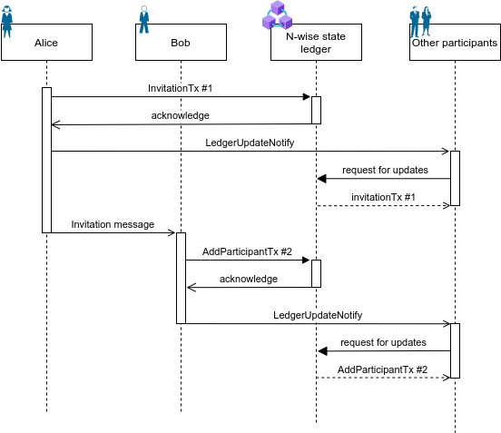

# Aries RFC 0748: N-wise DID Exchange Protocol 1.0

- Authors: [Mikhail Lytaev](mikelytaev@gmail.com), [Pavel Minenkov](minikspb@gmail.com)
- Status: [DEMONSTRATED](/README.md#demonstrated)
- Since: 2022-08-03
- Status Note: Under research
- Supersedes:
- Start Date: 2022-06-03
- Tags: [feature](/tags.md#feature), [protocol](/tags.md#protocol)
- URI: https://didcomm.org/n-wise/1.0

## Summary

This RFC defines a protocol for creating and managing relationships within a group of SSI subjects. In a certain sense, this RFC is a generalization of the pairwise concept and protocols [0160-connection-protocol](https://github.com/hyperledger/aries-rfcs/tree/main/features/0160-connection-protocol) and [0023-did-exchange](https://github.com/hyperledger/aries-rfcs/tree/main/features/0023-did-exchange) for an arbitrary number of parties (n-wise).

## Motivation

SSI subjects and [agents](https://github.com/hyperledger/aries-rfcs/tree/main/concepts/0004-agents) representing them must have a way to establish relationships with each other in a trustful manner. In the simplest case, when only two participants are involved, this goal is achieved using [0023-did-exchange](https://github.com/hyperledger/aries-rfcs/blob/main/features/0023-did-exchange/README.md) protocol by creating and securely sharing their DID Documents directly between agents. However, it is often desirable to organize an interaction involving more than two paries. The number of parties of such an interaction may change over time, and most of the agents may be mobile ones. The simplest and most frequently used example of such interaction is a group chat in instant messenger. The trusted nature of SSI technology makes it possible to use group relationships for holding legally significant unions, such as board of directors, territorial community or dissertation councils.

## Tutorial

### Name and Version

n-wise, version 1.0

URI: https://didcomm.org/n-wise/1.0

### Registry of n-wise states

The current state of n-wise is an up-to-date list of the parties' DID Documents. In pairwise relation the state is stored by the participants and updated by a direct notification of the other party. When there are more than two participants, the problem of synchronizing the state of this n-wise (i.e. [consensus](https://en.wikipedia.org/wiki/Consensus_(computer_science))) arising. It should be borne in mind that the state may change occasionally: users may be added or deleted, DID Documents may be modified (when keys are rotated or endpoints are changed).

In principle, any trusted repository can act as a registry of n-wise states. The following options for storing the n-wise state can be distinguished:

- #### Directly on the agent's side (Edge chain)

  - This approach is the closest to [0023-did-exchange](https://github.com/hyperledger/aries-rfcs/blob/main/features/0023-did-exchange/README.md) protocol. However since there are more than two participants, an additional consensus procedure is required to correctly account for changes in the n-wise state. This option is suitable if the participants are represented by cloud agents which are (almost) always online. In this case, a consensus can be established between them using the well-known algorithms (RAFT, Paxos, BFT). However, if most of the agents are mobile and are online only occasionally, the mentioned consensus algorithms are not applicable. So it is preferable to use external solutions for storing and updating the n-wise states.

- #### Public or private distributed ledger

  - In this case, the task of recording and storing the state is taken over by a third-party distributed network. The network can verify incoming transactions by executing a smart contract, or accept all incoming transactions, so transaction validation takes place only on the participating agents.

- #### Centralized storage

    - This case is applicable when security requirements allow participants to trust a centralized solution.

The concept of pluggable consensus implies choosing the most appropriate way to maintain a registry of states, depending on the needs.

N-wise state update is performed by committing the corresponding transaction to the registry of n-wise states. To get the current n-wise state, the agent receives a list of transactions from the registry of states, verifies them and applies sequentially, starting with the `genesisTx`. Incorrect transactions (without a proper signature or missing the required fields) are ignored. Thus, n-wise can be considered as a replicated state machine, which is executed on each participant.

The specifics of recording and receiving transactions depend on the particular method of maintaining the n-wise registry and on a particular ledger. This RFC DOES NOT DEFINE specific n-wise registry implementations.

### Roles

- ##### User

  - The party of n-wise. Has the right to:

    - Modify its DID Document;
    - Remove himself from n-wise;
    - Invite new parties.

- ##### Owner
  - In addition to user's rights, has the right to:
    - Remove other users from n-wise;
    - Modify n-wise meta information;
    - Transfer its role to another user.

  - There can be only one owner in n-wise at a time.

- ##### Creator

  - Creator of the n-wise and the author of `genesisTx`. 
  - The creator automatically becomes the owner of n-wise after creation.

- ##### Inviter

  - The n-wise participant who initiates the invitation of a new one.

- ##### Invitee

  - The participant accepting the invitation and connecting to n-wise. If successful, the participant becomes a user of n-wise.

### Actions

#### N-wise creation

The creation begins with the initialization of the n-wise registry. This RFC DOES NOT SPECIFY the procedure for n-wise registry creation. After creating the registry, the creator commits the `genesisTx` transaction. The creator automatically obtains the role of owner. The creator MUST generate a unique DID and DID Document for n-wise.

#### Invitation of a new party

Any n-wise party can create an invitation to join n-wise. First, inviter generates a pair of public and private invitation keys according to Ed25519. The public key of the invitation is pushed to the registry using the `invitationTx` transaction. Then the `Invitation` message with the invitation private key is sent out-of-band to the invitee. The invitation key pair is unique for each invitee and can be used only once.

#### Accepting the invitation

Once `Invitation` received, the invite generates a unique DID and DID Document for the n-wise and commits `AddParticipantTx` transaction to the registry.
It is NOT ALLOWED to reuse DID from other relationships.

The process of adding a new participant is shown in the figure below



#### Updating DID Document

Updating the user's DID Document is required for the key rotation or endpoint updating. To update the associated DID Document, user commits the `updateParticipantTx` transaction to the registry.

#### Removing a party form n-wise

Removing is performed using the `removeParticipantTx` transaction.
The user can delete itself (the corresponding transaction is signed by the user's public key). The owner can delete any user (the corresponding transaction is signed by the owner's public key).

#### Updating n-wise meta information

Meta information can be updated by the owner using the `updateMetadataTx` transaction.

#### Transferring the owner role to other user

The owner can transfer control of the n-wise to other user. The old owner loses the corresponding privileges and becomes a regular user. The operation is performed using the `NewOwnerTx` transaction.

#### Notification on n-wise state update

Just after committing the transaction to the n-wise registry, the participant MUST send the `ledger-update-notify` message to all other parties.
The participant who received `ledger-update-notify` SHOULD fetch updates from the n-wise registry.

### DIDComm messaging within n-wise

It is allowed to exchange DIDComm messages of any type within n-wise.
The belonging of the sender to a certain n-wise is determined by the sender's verkey.

This RFC DOES NOT DEFINE a procedure of exchanging messages within n-wise. In the simplest case, this can be implemented as sending a message to each participant in turn. In case of a large number of parties, it is advisable to consider using a centralized coordinator who would be responsible for the ordering and guaranteed sending of messages from the sender to the rest of parties.

## Reference

### N-wise registry transactions

N-wise state is modified using transactions in the following form

```json
{
  "type": "transaction type",
  ...
  "proof" {
    "type": "JcsEd25519Signature2020",
    "verificationMethod": "did:alice#key1",
    "signatureValue": "..."

  }
}
```

#### Attributes
* `type` - required attribute, type of transaction;
* `proof` - required attribute, transaction signature in [JSON-LD Proof](https://w3c-ccg.github.io/data-integrity-spec/) format;
* `verificationMethod` - required attribute, depends on the specific type of transaction and is defined below.

### GenesisTx

'GenesisTx' is a mandatory initial transaction that defines the basic properties of the n-wise.

```json
{
  "type": "genesisTx",
  "label": "Council",
  "creatorNickname": "Alice",
  "creatorDid": "did:alice",
  "creatorDidDoc": {
   ..
  },
  "ledgerType": "iota@1.0",
  "metaInfo" {
    ...
  }
}
```

#### Attributes
* `label` - required attribute, n-wise name;
* `creatorNickname` - required attribute, creator nickname;
* `creatorDid` - required attribute, DID of the creator;
* `creatorDidDoc` - required attribute, DID Document of the creator;
* `ledgerType` - required attribute, n-wise registry type;
* `metaInfo` - optional attribute, additional n-wise meta information; the format is determined by a particular n-wise state implementation;

The `genesisTx` transaction MUST be signed by the creator's public key defined in his DID Document.

### InvitationTx

This transaction adds the invitation public keys to the n-wise registry.

```json
{
  "type": "invitationTx",
  "publicKey": [
    {
      "id": "invitationVerkeyForBob",
      "type": "Ed25519VerificationKey2018",
      "publicKeyBase58": "arekhj893yh3489qh"
    }
  ]
}

```
#### Attributes
* `publicKey` - required attribute, array of invitation public keys;
* `id` - required attribute, invitation public key ID;
* `type` - required attribute, key type;
* `publicKeyBase58` - required attribute, base58 encoded public key.

invitationTx` MUST be signed by the user's public key defined in it's DID Document.

### Invitation message

The message is intended to invite a new participant. It is sent via an arbitrary communication channel (pairwise, QR code, e-mail, etc.).
 
```json
{
  "@id": "5678876542345",
  "@type": "https://didcomm.org/n-wise/1.0/invitation",
  "label": "Invitaion to join n-wise",
  "invitationKeyId": "invitationVerkeyForBob",
  "invitationPrivateKeyBase58": "qAue25rghuFRhrue....",
  "ledgerType": "iota@1.0",
  "ledger~attach": [
    {
      "@id": "attachment id",
      "mime-type": "application/json",
      "data": {
        "base64": "<bytes for base64>"
      }
    }  
  ]
}

```
#### Attributes
* `label` - optional attribute, human readable invitation text;
* `invitationKeyId` - required attribute, invitation key ID;
* `invitationPrivateKeyBase58`- required attribute, base58 encoded invitation private key;
* `ledgerType` - required attribute, n-wise registry type;
* `ledger~attach` - optional attribute, attachment with meta information, required for connection to n-wise registry; defined by a particular registry implementation.

### AddParticipantTx

The transaction is designed to add a new user to n-wise.

```json
{
  "id": "addParticipantTx",
  "nickname": "Bob",
  "did": "did:bob",
  "didDoc": {
    ...
  }
  
}

```
#### Attributes
* `nickname` - required attribute, user nickname;
* `did` - required attribute, user's DID;
* `didDoc` - required attribute, user's DID Document.

`AddParticipantTx` transaction MUST be signed by the invitation private key  (`invitationPrivateKeyBase58`), received in `Invitation` message. As committing the `AddParticipantTx` transaction, the corresponding invitation key pair is considered deactivated (other invitations cannot be signed by it).

The transaction executor MUST verify if the invitation key was indeed previously added. Execution of the transaction entails the addition of a new party to n-wise.

### UpdateParticipantTx

The transaction is intended to update information about the participant.

```json
{
  "type": "updateParticipantTx",
  "did": "did:bob",
  "nickname": "Updated Bob",
  "didDoc" {
    ...
  }
}

```
#### Attributes
* `did` - requred attribute, DID of the updating user;
* `nickname` - optional attribute, new nickname;
* `didDoc` - optional attribute, new DID document.

Transaction MUST be signed by the public key of the user being updated. The specified public key MUST be defined in the previous version of the DID Document.

Execution of the transaction entails updating information about the participant.

### RemoveParticipantTx

The transaction is designed to remove a party from n-wise.

```json
{
  "type": "removeParticipantTx",
  "did": "did:bob"
}
```
#### Attributes
* `did` - requred attribute, DID of the removing user;

The execution of the transaction entails the removal of the user and his DID Document from the list of n-wise parties.

The transaction MUST be signed by the public key of the user who is going to be removed from n-wise, or with the public key of the owner.

### UpdateMetadataTx

The transaction is intended to update the meta-information about n-wise.

```json
{
	"type": "updateMetadataTx",
	"label": "Updated Council"
	"metaInfo": {
	  ...
	}
}
```

#### Attributes
* `label` - optional attribute, new n-wise name;
* `metaInfo` - optional attribute, new n-wise meta-information.

The transaction MUST be signed by the owner's public key.

### NewOwnerTx

The transaction is intended to transfer the owner role to another user. The old owner simultaneously becomes a regular user.

```json
{
	"type": "newOwnerTx",
	"did": "did:bob"
}
```

#### Attributes
* `did` required attribute, new owner's DID.

The transaction MUST be signed by the owner's public key.

### ledger-update-notify

The message is intended to notify participants about the  modifications of the n-wise state.

```json
{
  "@id": "4287428424",
  "@type": "https://didcomm.org/n-wise/1.0/ledger-update-notify"
}
```

## Drawbacks

- External DLT is required;
- The user hierarchy is quite primitive.

## Rationale and alternatives
Public DID methods use blockchain networks or other public storages for its DID Documents. [Peer DID](https://identity.foundation/peer-did-method-spec/) rejects the use of external storage, which is absolutely justified for a pairwise relationship, since a DID Document can be stored by the other participant. If there are more than two participants, consensus on the list of DID Documents is required. N-wise is  somewhat of a middle ground between a Peer DID (DID document is stored only by a partner) and a public DID (DID document is available to everyone in the internet). So, the concept of n-wise state registry was introduced in this RFC, and its specific implementations (consensus between participants or a third-party trusted registry) remain at the discretion of the  n-wise creator. The concept of [microledger](https://github.com/the-human-colossus-foundation/microledger-spec/blob/main/microledger.md) is also considerable to use for the n-wise state registry.

One more promising high-level concept for building n-wise protocols is
[Gossyp](https://github.com/dhh1128/didcomm.org/tree/gossyp/gossyp).

## Prior art

The term of n-wise was proposed in [Peer DID](https://identity.foundation/peer-did-method-spec/) specification, and previously discussed in [document](https://docs.google.com/document/d/1BjYdivGQ9GxIz9CJ2ymNvMA68uHZm8bFOTyCHDmziOU/edit#). However, no strict formalization of this process was proposed, as well as the need for consensus between the participants was not noted.

## Unresolved questions

* Who should be responsible for the order of transactions?
* How to define specific n-wise state registry implementations (separate RFCs?)
* How to make a flexible user hierarchy?

## Implementations
The following lists the implementations (if any) of this RFC. Please do a pull request to add your implementation. If the implementation is open source, include a link to the repo or to the implementation within the repo. Please be consistent in the "Name" field so that a mechanical processing of the RFCs can generate a list of all RFCs supported by an Aries implementation.

Name / Link | Implementation Notes
--- | ---
[Sirius SDK Java](https://github.com/Sirius-social/sirius-sdk-java/) | [IOTA Ledger](https://www.iota.org/) based implementation ([IOTA n-wise registry spec](https://github.com/Sirius-social/docs/blob/main/specs/iota-n-wise-registry.md)). See a detailed [example](https://github.com/Sirius-social/Notebooks/blob/main/notebooks/NwiseJava.ipynb) in Jupyter notebook.
