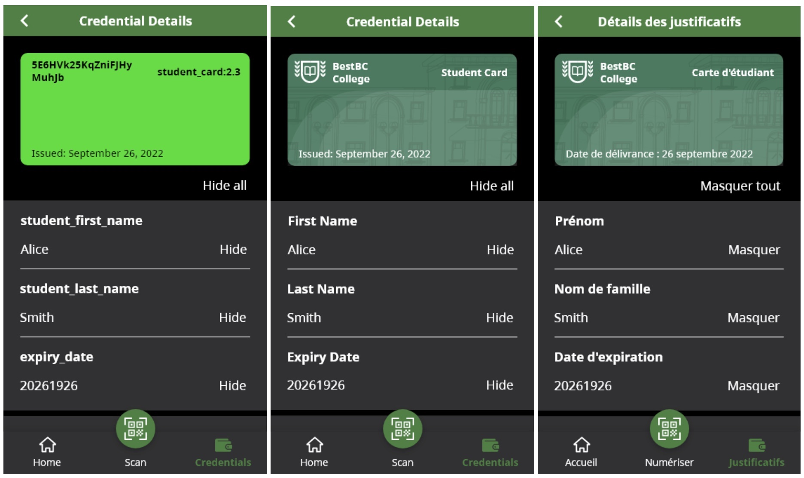

# 0755: Overlays Capture Architecture (OCA) For Aries

- Authors: [Stephen Curran](swcurran@gmail.com)
- Status: [PROPOSED](/README.md#proposed)
- Since: 2022-09-27
- Status Note: In the process of being implemented in several Aries Frameworks (ACA-Py, AFJ)
- Supersedes: Sort of supersedes [0013-Overlays](/concepts/0013-overlays/README.md) in that RFC is about OCA.
- Start Date: 2022-09-25
- Tags: [concept](/tags.md#concept)

## Summary

[Overlays Capture Architecture](https://oca.colossi.network/) (OCA) is, per the
specification, a "standardized global solution for data capture and exchange."
Given a data structure (such as a verifiable credential), OCA allows for the
creation of purpose-specific overlays about that data structure. Each overlays
provides some knowledge about the overall data structure or the individual
attributes within it. The information in the overlays makes if possible to
create useful software for capturing data, displaying it and exchanging it.
While the OCA [site](https://oca.colossi.network/) and
[specification](https://oca.colossi.network/v1.1.0-rc.html) can be reviewed for
a detailed background of OCA and it's various purposes, it's purpose in Aries is
quite constrained and pragmatic--a mechanism for an issuer to provide
information about a verifiable credential to allow holder and verifier software
to display the credential in a human-friendly way, with the issuer's preferred
branding. The image below shows an Aries mobile Wallet displaying the same
credential without and with OCA overlays applied in two languages. All of the
differences in the latter two screenshots from the first come from the
issuer-supplied OCA data.



This RFC formalizes how Aries verifiable credential issuers (at least) can
use OCA to publish the following information for each type of credential they
issue.

- Metadata about the credential, such as its name and description, in multiple
  languages.
- Type, format and encoding information about the credential's raw attribute
  data.
- Multilingual information about attributes within the credential, such as a
  label and help text for each attribute.
- A set of branding elements (logo, background image, color and so on) that
  holder and verifier software can use in displaying the credential on-screen.
- Information to improve the accessibility of the display of the credential.

The flow of data between participants is as follows. An issuer creates OCA
information for each type of verifiable credential it issues. On receipt of a
credential of a given type from a given issuer, a holder can retrieve the OCA
information published by the issuer and use that data to display the credential
for its user(s) in the language of their choice and with credential branding
from the issuer. Likewise, a verifier receiving a presentation derived from a
given credential type can retrieve the OCA information published by the issuer
for that type of credential for use in the processing and displaying of the
claims.

## Motivation

The core data models for verifiable credentials are much more concerned about
the correct cryptographic processing of the credentials than about general
processing of the attribute data, and the user experience of those using
credentials. An AnonCreds verifiable credential contains the bare minimum of
metadata about a credential--basically, just the non-standardized,
developer-style names for the type of credential and the attributes within it.
JSON-LD verifiable credentials has the capacity to add more information about
the attributes in a credential, but the data is not easily accessed. The use of
OCA allows the issuer to declare information about the verifiable credential
types it issues to improves the handling of those credentials by holder and
verifier software, and to improve the on-screen display of the credential,
including the application of issuer-specified branding elements.

It is quite deliberate that the credential branding defined in this RFC does
not attempt to achieve pixel-perfect on screen rendering of the equivalent

## Tutorial

The tutorial section of this RFC defines the coordination necessary for an
the creation, publishing, retrieval and use of an OCA Bundle for a given
type of verifiable credential.

``` Note

In this overview, we assume the use of AnonCreds verifiable credentials and 
the use of OCA specifically for verifiable credentials. OCA can also be used
with the JSON-LD-style W3C Verifiable Credential Data Model, and can be applied to
any data structure, not just verifiable credentials. As community  members apply
OCA to W3C Verifiable Credential Data Model credentials, we will extend this
RFC.

```

### Issuer Activities

The use of OCA begins with the Issuer (see note below about other than the
Issuer providing OCA data) preparing an "OCA Bundle", a JSON data structure
consisting of the Base Capture overlay, and some number of additional overlays
of different types (listed below). While the OCA Bundle can be manually edited,
a common method of generating the OCA Bundle is to use a spreadsheet as an OCA
Source file, and generating the OCA Bundle from source. See the section of this
RFC called [OCA Tooling](#oca-tooling) for information on tools available for
managing OCA Source data.

#### OCA Specification Overlays

All OCA data begins with the [Capture
Base](https://oca.colossi.network/v1.1.0-rc.html#capture-base). For AnonCreds,
the Capture Base is the list of attributes in the schema for the given
credential type. The Capture Base also contains:

- the type of the attribute, based on an enumerated list of [types defined in
  the OCA
  specification](https://oca.colossi.network/v1.1.0-rc.html#attribute-type)
- a list of the base attributes that will hold Personally Identifiable
Information (PII). An issuer should use the [Kantara Initiative's Blinding
Identity
Taxonomy](https://docs.kantarainitiative.org/Blinding-Identity-Taxonomy-Report-Version-1.0.html)
to identify the attributes to flag as being PII.

With the Capture Base defined, the following additional overlays MAY be declared
by the Issuer and SHOULD be expected by the holder and verifier. The overlays flagged
with "multilingual" can have multiple instances of the overlay, one for each issuer-supported
language (English, French, Spanish, Braile, etc.).

- the [character_encoding
overlay](https://oca.colossi.network/v1.1.0-rc.html#character-encoding-overlay)
contains the encoding (usually "utf-8" or "base64") for each attribute in the
capture base.
- the [format overlay](https://oca.colossi.network/v1.1.0-rc.html#format-overlay) defines an input structure
for the data. The format may be useful in displaying the data in a style expected by the user, based on
the content of the data and their language preferences. For example, displaying the elements of a date
in the user's preferred format.
- the multilingual [label overlay](https://oca.colossi.network/v1.1.0-rc.html#label-overlay) defines a
label to be used for each attribute for a given language. The label overlay also includes labels for
attributes with enumerated values. For example, if a data attribute might contains the codes "EN", "FR", "SP"
that mean "English", "French" and "Spanish", respectively.
- the multilingual [information
overlay](https://oca.colossi.network/v1.1.0-rc.html#information-overlay) defines
a description or help text about each attribute for a given language. There will
be one overlay per issuer-supported language.
- the multilingual [meta overlay](https://oca.colossi.network/v1.1.0-rc.html#meta-overlay) contains
information about the credential itself, such as "name" and "description."

##### The AnonCreds "dateint" Format

A common data format used in Aries AnonCreds verifiable credentials is "`dateint`", as
described in [RFC 0592](../0592-indy-attachments/README.md). A `dateint` is a date stored
as an integer (for example `September 29, 2022` is the integer `20,220,929`). In the format
overlay, `dateint` is a permitted value when used with Aries. An recipient of an OCA Bundle
with a `dateint` SHOULD extract from the integer data value the year, month and day and
display those elements in the style appropriate for the user. For example, a mobile app
should display the data as a date based on the user's language/country setting.

#### Aries Specific Overlays

In addition to the core OCA Overlays listed above, Aries agents also use an
additional "extension" overlay, the [credential_branding overlay](#), that
provides the issuer with a way to provide a series of data elements about the
credential branding that they would like to see applied. The credential_branding
overlay provides a list of name/value pairs, and the holders (and verifiers) can
use the values when displaying the credential of that type from that issuer. The
holder/verifier controls the details of how the credentials are displayed, but
the issuer does have some input into the branding. The following are the branding
data elements the issuer can set:

- logo_uri - a URI pointing to a logo to display with the credential.
- logo_base64 - an inline, base64-encoded logo to display with the credential.
- background_image_uri - a URI pointing to a background image to display under
  the credential data.
- background_image_base64 -  - an inline base64-encoded background image to display under the
  credential data.
- header_background_color - an RGB color code for the credential display header
  background color.
- footer_background_color - an RGB color code for the credential display footer
  background color.
- header_font_color - an RGB color code for the credential display header font
  color.
- footer_font_color - an RGB color code for the credential display footer font
  color.
- primary_attribute - the name of the primary capture base attribute to display
  on the credential.
- secondary_attribute - the name of the secondary capture base attribute to
  display on the credential.

This [Aries Credential Branding Style Guide](https://docs.google.com/document/d/1_tMS2F3A9y6xStVM-37-qlf4mXU-hYDW/edit?usp=sharing&ouid=109116496535883458301&rtpof=true&sd=true)
should be used by both issuer in creating their Credential Branding overlay, and by
holder and verifier software makers in using the data in the Credential Branding overlay
to present credentials.

``` todo

To Do: Convert the Style Guide to a markdown file within the RFC folder.

```

#### OCA Issuer Tools

While a creator of an Aries OCA Bundle could manage the JSON content of the OCA
Bundle manually, it is not easy. An easier way to do that is to use an "Aries
OCA Source" spreadsheet and use the `aries-oca-source-to-bundle` converter to
create the bundle. Ideally, the Aries OCA Source spreadsheet file is stored in
version control and a pipeline action (such as this GitHub action) can be used
to generated the OCA Bundle when the source file is updated.

The OCA Source Spreadsheet contains the following:

- An introductory tab with guidance on how to use the spreadsheet.
- A Capture Base tab with information about the attributes in the credential.
- A Branding tab with information about the issuer and the branding of the
  credential.
- A country-language code per country-language to be supported with containing
  all multilingual overlays.

The use of a spreadsheet, especially an online one, is particularly useful for
this use case where it is expected that multiple translation experts will be
called upon to provide the OCA Source data for each supported country-language
combination.

``` todo

Add links to a sample starter spreadsheet and the referenced tools

```

#### Issuing A Credential

The primary mechanism for an issuer to provide an OCA Bundle to a holder is when
issuing a credential using [RFC0453 Issue
Credential](../0453-issue-credential-v2/), version 2.2 or later, the issuer can
provide with the credential an OCA Bundle as a [credential supplement](). The
type of the supplement is `issuer-oca-bundle`. The attachment MUST be
[signed](../../concepts/0017-attachments#signing-attachments) by the issuer, and
may be of [type `base64url`](../../concepts/0017-attachments#base64url), meaning
the OCA Bundle is embedded in the message, or of [type
`link`](../../concepts/0017-attachments#links). There are other mechanisms
for issuers to get OCA Bundles to issuers outlined [here](#other-oca-bundle-sources).

An OCA Bundle attachment must be signed by the issuer so that if the holder
passes the OCA Bundle on to the verifier, the verifier can be certain that the
issuer provided the OCA Bundle, and that it was not created by the holder.

``` todo

To Do: Add warning about the use of an attachment type of link being a potential "phone home"
surveillance technique by the issuer. For example, an issuer might specify in the link URI a unique ID for every credential
it issuers. The issuer would then know if/when the credential supplement was
passed to a verifier and retrieved, letting the issuer know when and with whom
a specific holder's credential was shared. This also applies to the "uri"
elements of the Credential Branding overlay -- the logo and background image. Note that
the "phone home" rule is not a problem for the holder getting the OCA Bundle -- the issuer already knows the holder,
but it could be a problem if the holder passes a "tracking" OCA Bundle to its verifiers.

Proposals:

- Suggest that if there are links for either the OCA Bundle itself
or for the images in the overlays, that the holder NOT pass the OCA Bundle to
the verifier.
- Break the "branding" element into two parts
the logo/images ("assets overlay") and the rest of the settings ("branding overlay"). Stick
to the "no links" rule above, but since the links are likely to be only with the "assets" OCA Bundle
the verifier is more likely to get at least some of the data from the issuer.

Other ideas?

```

### Holder Activities

On receipt of a credential with OCA Bundle supplement, the holder should
associate the OCA Bundle with the credential type, and use the OCA Bundle when
processing and displaying credentials of that type. Holder software developers
should be familiar with the overlays the issuer is likely to provide (see list
[here](#oca-specification-overlays)) and how to use them. For example:

- Check the country and language settings of the current user and use the
appropriate multilingual overlays to respect those settings in displaying
credential metadata and attributes (labels, etc.).
- Consider adding multilingual informational popups in your app using the per
  attribute data in the "information" overlay.
- Consider using the PII flag in the Capture Base to provide guidance to the
  user about the sharing of PII.
- Use the credential branding overlay and the [Aries Credential Branding Style
  Guide](#) in displaying the credential in various contexts (e.g. in a list,
  selected in a list, alone on a page).
- Use the `type`, `encoding` and `format` values for processing and displaying
  specific attributes for a given user. For example, display dates in a format
  suitable for the language and country settings for the user.
- Use the OCA-provide metadata about the credential, such as the
  name/description of the issuer, name/description of the credential type.

#### Adding OCA Bundles to Present Proof Messages

Once a holder has an OCA Bundle for a credential type, it may pass the OCA
Bundle to a verifier when a presenting a proof that includes claims from that
credential type. This can be done via the same [credential supplements]()
approach as when the credential was issued to the holder. When constructing
the `present_proof` message to hold a proof, the holder would iterate through the
credential definitions used in the proof, and if there is an OCA Bundle
for that credential definition, and add it as a supplement to the message. The
signature from the Issuer should be included with the supplement.

A holder SHOULD not send an OCA Bundle to a verifier if the OCA Bundle is a
link, or if any of the data items in the OCA Bundle are links. Such links could
be an attempt by a malicious issuer to track the activity of a holder's
credential and so for the safety of the holder, such OCA Bundles should not be
provided to verifiers.

### Verifier Activities

A verifier might, on receipt of a presentation from a holder, also receive an
OCA Bundle as a signed (by the issuer) attachment for some or all of the
credential types in the presentation. This gives the verifier access to all of
the same information about the credential as the holder. In a presentation
only some of the claims from each credential are likely to be provided, so
the "credential branding" OCA Bundle content might be less useful, the per
attribute data, and especially the type, encoding, format and multilingual
label/information data might be particularly useful when displaying the
information to a person is necessary.

### Other OCA Bundle Sources

While having the issuer provide the OCA Bundle for a credential type directly to
the holder is explicit, there can be other ways for a holder (or verifier) to
get an OCA Bundle for different types of credentials.

If supported by the Verifiable Data Registry (VDR) used the issuer, an OCA
Bundle could be published to the VDR. In that case, a holder or verifier could
query the VDR for an OCA Bundle by Credential Definition ID to see if there is
an OCA Bundle associated with the Credential Definition.

A holder or verifier could be configured to access a registry of OCA Bundles
from issuers. When a credential type is received (as a holder or verifier), the
Aries agent could query the registry REST API by Credential Definition and receive back
if there is a published OCA Bundle for that Credential Definition from the
issuer.

As the use of OCA ramps up in the Aries community and the number of issuers is
small, a maker of holder/verifier software might "self-publish" OCA Bundles for
a number of issuers and credential types to improve their users' experience. The
interface would be the same as for the registry of OCA Bundles (e.g. a REST API)
by Credential Definition. The holder software might in that case accept that
the issuer did not sign and publish the OCA Bundle.

## Reference

### Assets Overlay Specification

### Branding Overlay Specification

### Credential Supplement Examples 


## Drawbacks

- The use of links either for OCA Bundles or for assets that are embedded in OCA
  Bundles are both extremely useful and problematic, as documented in the RFC.
  It would be nice to be able to allow links for/in the OCA Bundles without the
  potential of being used to track the holder.
- If the OCA Bundle is passed to the holder as a link, the issuer must continue
  to make that content available for as long as the holder might retain the
  credential. Putting the OCA Bundle on a ledger/blockchain might be a good way
  to publish such data.

## Rationale and alternatives

- The OCA architecture seems ideally suited to the Aries verifiable credential
use case, supporting the important capabilities of data formats, accessibility
support, multilingual support and the desire for issuers to brand their
credentials.
- The use of JSON-LD could provide some of the required capabilities covered by
OCA (such as multilingual labels), but that solution requires adding
considerable overhead and far more complicated processing to achieve a fraction
of capabilities.
- The current situation of having almost no metadata about credentials is
extremely limiting.
  - Extracting best available metadata from the Schema and Credential Definition
    objects, converting developer attribute/credential names of human friendly
    (e.g. "given_name" to Given Name, or "ssn" to "Ssn") and using that for the
    display of a credential.
  - The random generation of a background color for a given credential for use
  when displaying a credential.

## Prior art

None, as far as we are aware.

## Unresolved questions

- Are there better ways for issuers to publish OCA Bundles for consumption by
  holders/verifiers?
- How do we balance the prevention of possible tracking by issuers, and the use
  of links to OCA Bundles or assets within OCA Bundles
   
## Implementations

The following lists the implementations (if any) of this RFC. Please do a pull request to add your implementation. If the implementation is open source, include a link to the repo or to the implementation within the repo. Please be consistent in the "Name" field so that a mechanical processing of the RFCs can generate a list of all RFCs supported by an Aries implementation.

*Implementation Notes* [may need to include a link to test results](/README.md#accepted).

Name / Link | Implementation Notes
--- | ---
 | 

