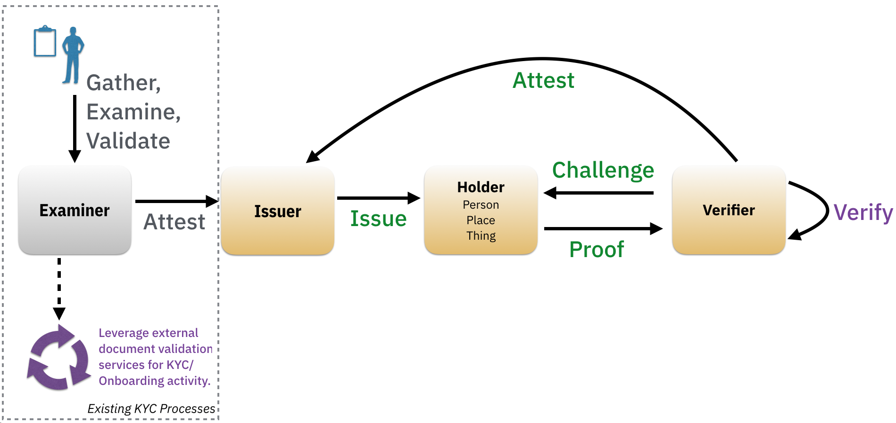

# 0000: Evidence Exchange Protocol
- Author: [Dan Gisolfi](mailto:dan.gisolfi@gmail.com)
- Start Date: 2019-07-05

## Status
- Status: [PROPOSED](/README.md#rfc-lifecycle)
- Status Date: (date of first submission or last status change)
- Status Note: (explanation of current status; if adopted,
  links to impls or derivative ideas; if superseded, link to replacement)

## Summary
Define a P2P document exchange protocol that does not involve a centralized storage facility. The protocol must allow parties using [pair-wise peer DIDs](https://github.com/openssi/peer-did-method-spec) to exchange documents that provide evidence in support of the issuance of verified credentials.

## Motivation
During the identity verification process, an entity *may* require access to the genisis docuemets used to establish digital credentials issued by an credential issuing entity.  In support of the transition from existing business verification processes to emerging business processes that rely on digitally verified credentials using protocols such as [0036-issue-credential](https://github.com/hyperledger/aries-rfcs/tree/master/features/0036-issue-credential) and [0037-present-proof](https://github.com/hyperledger/aries-rfcs/tree/master/features/0037-present-proof), we need to establish a set of protocols that allow entities to make this transition while remaining compliant with business and regulatory requirements.

### Understanding KYC
*Know Your Customer (KYC)* is a process by which entities (business, governments, organizations) obtain information about the identity and address of their customers. This process helps to ensure that the services that the entity provides are not misused. KYC procedures vary based on geolocation and industry. For example, the KYC documents required to open a bank account in India versus the USA may differ but the basic intent of demonstrating proof of identity and address are similar. Additionally, the KYC documents necessary to meet business processing requirements for enrollment in a university may differ from that of onboarding a new employee.

Regardless of the type of KYC processing performed by an entity, there may be regulatory or business best practice requirements that mandate access to the original documents presented as evidence during the KYC process. As entities transition from paper/plastic based identity proofing practices to digitally verifiable credentials, there may exist (albeit only for a transitional period) the need to gain access to the documents that an issuer examined before issuing credentials.  

### KYC Document Vetting
The [Verifiable Credentials Specification](https://www.w3.org/TR/verifiable-claims-data-model/) describes three key stakeholders in an ecosystem that manages digital credentials: Issuers, Holders and Verifiers. However, before an Issuer can attest to claims about a Holder, an *Examiner* must perform the required vetting, due diligence, regulatory compliance and other tasks needed to establish confidence in making a claim about an identity trait associated with a Holder. The actions of the Examiner may include physical validation of information (i.e.: comparison of real person to a photo) as well as reliance on third party services as part of its vetting process. Depending on the situational context of a credential request or the type of privileges to be granted, the complexity of the vetting process taken by an examiner to confirm the truth about a specific trait may vary.



An identity Holder may present to an Examiner a specific type of KYC document to establish proof of identity. The presentment of these KYC documents may come in a variety of formats:

* `Paper/Plastic`: Typically associated with a face to face interaction for the exchange of documents.
* `Digital Copy`: Typically associated with an online exchange whereby the the Holder uploads a scanned image of the original source (Paper/Plastic) document.
* `URL`: Holder can provide a link to a digital document version of the original source (Paper/Plastic) document on some 3rd Party file storage solution:
  * Document Storage Provider (Dropbox, iCloud)
  * Credential Issuing Agent (Retail Bank, Credit Union, Verification Service Provider)

### Evidence Access Matrix

>Note: Assumption herein is that original documents are never forfeited by an individual.

| Original Source Format | Issuer Archived Format | Verifier KYC Process Format | Protocol Requirement |
| --- | --- | --- | --- |
| Paper/Plastic | Paper-Copy | n/a | n/a |
| Paper/Plastic | Digital Copy | Digital Copy | Access by Value |
| Paper/Plastic | Digital Copy | URL | Access by Reference |
| Digital Copy | Digital Copy | Digital Copy | Access by Value |
| Digital Copy | Digital Copy | URL | Access by Reference |
| URL | Digital Copy | Digital Copy | Access by Value |
| URL | Digital Copy | URL | Access by Reference |

### Why a Peer DID Protocol?
In a decentralized identity ecosystem where peer relationships no longer depend a centralized authority for the source of truth, why should a Verifier refer to some 3rd party or back to the Issuing institution for KYC processing evidence?

* Centralized Shared-KYC Providers: While there seems to be a [trend to build shared ledgers](#reference) that manage the exchange of KYC documents and data, we can not ignore the user-centric privacy by design principle that is foundational to decentralized identity solutions. Pair-wise Peer DIDs offer an alternative approach that is independent of any central source of truth, and are intended to be cheap, fast, scalable, and secure. The [advantages of Pair-wise Peer DIDs](https://github.io/peer-did-method-spec/index.html#advantages) make them suitable for most private relationships between people, organizations, and things.  
* Issuer Communications: B2B interactions between a Verifier of a credential and the Issuer of the credential injects unnecessary correlation and behavior privacy risks for the Holder.  

## Solution Concepts

### Protocol Assumptions

1. Holder *must* present doc access to Verifier such that Verifier can be assured that the Issuer vetted the document.
2. Some business processes and/or regulatory compliance requirements *may* demand that a Verifier gains access to the original vetted documents of an Issuer.
3. Some Issuers *may* accept digital access links to documents as input into vetting process. This is often associated with Issuers who will accept copies of the original documents.

### Protocol Objectives

In order for a Verifier to avoid or reduce KYC vetting expenses it must be able to:

* be convinced that a trusted entity has performed the necessary vetting;
* know, if required, that access to the original vetted document(s) is possible.

This implies that the protocol *must* address the following evidence concerns:

| Interaction Type | Challenge | Protocol Approach |
| --- | --- | --- |
| Examiner-to-Holder | How does Issuer provide Holder with evidence that it has **vetted** a KYC document? |Issuer signs hash of the document and presents signature to Holder. |
| Holder-to-Verifier | How does Holder **present** Verifier with evidence that the Issuer of a Credential vetted an original source document? |Holder presents verifier with digitally signed hash of document, public DID of Issuer and access to a copy of the digital document. |
| Verifier-to-FileStorageProvider | How does Verifier **access** the document in digital format (base64)? | Issuer or Holder must provide secure access to a digital copy of the document. |
| Verifier-to-Verifier | How does Verifier **validate** that Issuer attests to the vetting of the original source as evidence for personal data claims encapsulated in issued credentials? | Verifier gains access to the digital document, fetches the public key of associated with the Issuer's DID and validates Issuer's signature of document hash. |

### Protocol Outcome
This protocol is intended to be a compliment to the foundational (issuance, verification) protocols for credential lifecycle management in support of the [Verifiable Credentials Specification](https://www.w3.org/TR/verifiable-claims-data-model/). Overtime, it is assumed that the exchange of original source documents will no longer be necessary as digital credentials become ubiquitous. In the meantime, the trust in and access to KYC documents can be achieved in private peer to peer relationships using the [Peer DID Spec](thub.com/openssi/peer-did-method-spec).

### User Stories
The applicability of this protocol to real world user scenarios is discussed in the context of a [digital notary](./digital_notary_usecase.md) where the credential issuing institution is not the issuer of the original source document(s).

### KYC Document Types
The following, *non-exhaustive*, list of common KYC Documents are used for establishing *proof of identity*, *proof of address*. They are often accompanied with a recent photograph. Since this protocol is intended to be agnostic of business and regulatory processes, the types of acceptable KYC documents will vary.

| Proof Type | Sample Documents |
| --- | --- |
| Address | Passport, Voter’s Identity Card, Utility Bill (Gas, Electric, Telephone/Mobile), Bank Account Statement, Letter from any recognized public authority or public servant, Credit Card Statement, House Purchase deed, Lease agreement along with last 3 months rent receipt, Employer’s certificate for residence proof |
| Identity | Passport, [PAN Card](https://en.wikipedia.org/wiki/Permanent_account_number), Voter’s Identity Card, Driving License, Photo identity proof of Central or State government, Ration card with photograph, Letter from a recognized public authority or public servant, Bank Pass Book bearing photograph, Employee identity card of a listed company or public sector company, Identity card of University or board of education |
| Photo | Passport, Pistol Permit, Photo identity proof of Central or State government |

## Tutorial

The evidence exchange protocol builds on the attachment decorator within DIDComm using the [Appending Method](https://github.com/hyperledger/aries-rfcs/blob/master/concepts/0017-attachments/README.md#appending).

The protocol is comprised of the following messages and associated actions:

| Interaction Type | Message | Process Actions |
| --- | --- | --- |
| Holder to Issuer | Request Evidence | Holder explores list of credentials received from Issuer and sends a ```evidence_request``` message to Issuer's agent. |
| Issuer to Holder | Evidence Response | Issuer collects KYC Documents associated with each requested credential ID and sends a ```evidence_response``` message to Holder's agent. Upon receipt, the Holder stores evidence data in Wallet. |
| Verifier to Holder | Evidence Access Request | Verifier builds and sends a ```evidence_access_request``` message to Holder's agent. |
| Holder to Verifier | Evidence Access Response | Holder builds and sends a ```evidence_access_response``` message to Verifier's agent.  Verifier fetches and validates Issuer attestation around requested documents. Verifier stores  evidence in system of record.|

### Request Evidence Message
This message should be used as an accompaniment to an [issue credential message](https://github.com/hyperledger/aries-rfcs/tree/master/features/0036-issue-credential#issue-credential). Upon receipt and storage of a credential the Holder should compose an ```evidence_request``` for each credential received from the Issuer. The Holder may use this message to get an update for new and existing credential from the Issuer.

```json
{
  "@type": "did:sov:BzCbsNYhMrjHiqZDTUASHg;spec/evidence_exchange/1.0/evidence_request",
  "@id": "6a4986dd-f50e-4ed5-a389-718e61517207",
  "for": "did:peer:1-F1220479cbc07c3f991725836a3aa2a581ca2029198aa420b9d99bc0e131d9f3e2cbe",
  "as_of_time": "2019-07-23 18:05:06.123Z",
  "credentials": ["cred-001", "cred-002"],
  "request-type": "by-value"
}
```

Description of attributes:

* `credentials` -- A list of credential IDs associated with this pair-wise relationship with the Issuer.
* `request-type` -- Stipulates how the Holder's Agent will manage the document access. If ```by-value```, then a copy of the document will be stored by the Holder. If ```by-reference```, then the storage provider service used by the Issuer will be the source of the document. If ```by-reference``` is used, then the complexity of the Evidence Access Response message will be impacted. However, it is preferable that document copies are minimized and as such avoid ```by-value``` where possible.  

### Evidence Response Message
This message is required for an Issuer Agent in response to an ```evidence_request``` message. The ```~attach``` attribute response format will be determined by the ```request_type``` attribute of the associated request message from a Holder.  

```json
{
  "@type": "did:sov:BzCbsNYhMrjHiqZDTUASHg;spec/evidence_exchange/1.0/evidence_response",
  "@id": "1517207d-f50e-4ed5-a389-6a4986d718e6",
  "~thread": { "thid": "6a4986dd-f50e-4ed5-a389-718e61517207" },
  "for": "did:peer:1-F1220479cbc07c3f991725836a3aa2a581ca2029198aa420b9d99bc0e131d9f3e2cbe",
  "as_of_time": "2019-07-23 18:05:06.123Z",
  "credentials": [
    { "@id": "cred-001",
      "evidence": [
        {"evidence_type": "Address", "docref": ["#kycdoc1"]},
        {"evidence_type": "Identity", "docref": ["#kycdoc2"]},
        {"evidence_type": "Photo", "docref": null},
      ]
    },
    { "@id": "cred-002",
      "evidence": [
        {"evidence_type": "Address", "docref": ["#kycdoc1","#kycdoc3"]},
        {"evidence_type": "Identity", "docref": ["#kycdoc3"]},
        {"evidence_type": "Photo", "docref": ["#kycdoc1"]},
      ]
    }
  ],
  "~attach": [ ...
  ]
}
```

Description of attributes:

* `credentials` -- A list of credential IDs each containing an array of evidence.
  * `@id` -- Corresponds to each ID associated with the list of credential IDs supplied by the Holder in the ```evidence_request``` message.
  * `evidence` -- An array of evidence attachments associated with each type of evidence the Issuer has established for a specific credential.
    * `evidence_type` -- Stipulates the type of KYC Document proofing (Address, Identity or Photo) performed for a set of attachments.
    * `docref` --  An array of attachment reference IDs pertaining to the list of KYC Documents used by the Issuer to establish certitude about the Holder.
* `~attach` -- An array of embedded attachments either by-value or by-reference.


#### By-value Attachments

```json
{
  "~attach": [
    {
      "@id": "kycdoc1",
      "description": "driver's license",
      "vetting_process": "physical",
      "data": {
        "base64": <base64 of the file>
      },
      "signature": "f67945faf9e89fg3kkh3vvvb68b53d5nh7900fn499040cd3728c0f099c002123"
    },
    {
      "@id": "kycdoc2",
      "vetting_process": "external service",
      "description": "ACME Electric Utility Bill",
      "data": {
        "base64": <base64 of the file>
      },
      "signature": "945faf9e8999040cd3728c0f099c002123f67fg3kkh3vvvb68b53d5nh7900fn4"
    },
    {
      "@id": "kycdoc3",
      "vetting_process": "physical, barcode; external service",
      "description": "State Concealed Carry Permit",
      "data": {
        "sha256": "1d9eb668b53d99c002123f1ffa4db0cd3728c0f0945faf525c5ee4a2d4289904",
        "base64": <base64 of the file>
      },
      "signature": "5nh7900fn499040cd3728c0f0945faf9e89kkh3vvvb68b53d99c002123f67fg3"
    }
  ]
}
```

Description of attributes augments the [content formats oulined in the Aries Attachments RFC ](https://github.com/hyperledger/aries-rfcs/blob/master/concepts/0017-attachments/README.md#base64) with the following additions:

* `sha256` -- Optional hash of the content. Can be useful as an integrity check by Holder.
* `vetting_process` -- A descriptive field allowing the Issuer to specify the type of due diligence performed on the attached document.
* `description` --  A human readable description of the type of document.
* `signature` -- Required RSA/SHA-256 Signature of the document. This is required for downstream processing by the Verifier so that the Holder can demonstrate that the Issuer was the attesting source of the document.

#### By-reference Attachments

```json
{
  "~attach": [
    {
      "@id": "kycdoc1",
      "description": "driver's license",
      "vetting_process": "physical",
      "data": {
        "sha256": "1d9eb668b53d99c002123f1ffa4db0cd3728c0f0945faf525c5ee4a2d4289904",
        "links": ["https://www.dropbox.com/s/r8rjizriaHw8T79hlidyAfe4DbWFcJYocef5/myDL.png"]
      },
      "signature": "f67945faf9e89fg3kkh3vvvb68b53d5nh7900fn499040cd3728c0f099c002123"
    },
    {
      "@id": "kycdoc2",
      "vetting_process": "external service",
      "description": "ACME Electric Utility Bill",
      "data": {
        "sha256": "1d4db525c5ee4a2d42899040cd3728c0f0945faf9eb668b53d99c002123f1ffa",
        "links": ["s3://mybucket/mykeyoyHw8T7Afe4DbWFcJYocef5"]
      },
      "signature": "945faf9e8999040cd3728c0f099c002123f67fg3kkh3vvvb68b53d5nh7900fn4"
    },
    {
      "@id": "kycdoc3",
      "vetting_process": "physical, barcode; external service",
      "description": "State Concealed Carry Permit",
      "data": {
        "sha256": "b53d99c002123f1ffa2d42899040cd3728c0f0945fa1d4db525c5ee4af9eb668",
        "links": ["https://myssiAgent.com/mykeyoyHw8T7Afe4DbWFcJYocef5"]
      },
      "signature": "5nh7900fn499040cd3728c0f0945faf9e89kkh3vvvb68b53d99c002123f67fg3"
    }
  ]
}
```

Description of attributes augments the [content formats outlined in the Aries Attachments RFC ](https://github.com/hyperledger/aries-rfcs/blob/master/concepts/0017-attachments/README.md#base64) with the following additions:

* `sha256` -- Optional hash of the content. Including this field makes the content tamper-evident.
* `links` -- A list of zero or more locations at which the content may be fetched.
* `vetting_process` -- A descriptive field allowing the Issuer to specify the type of due diligence performed on the attached document.
* `description` --  A human readable description of the type of document.
* `signature` -- Required RSA/SHA-256 Signature of the document. This is required for downstream processing by the Verifier so that the Holder can demonstrate that the Issuer was the attesting source of the document.

>Note: A by-reference link to a URL hosted by the Issuer does not break the correlation concern since by this point in the pair-wise peer relationship, the Verifier already knows who Issued the Holder a Credential.  

Upon completion of the Evidence Request and Response exchange, the Holder's Agent is now able to present any Verifier that has accepted a specific Issuer credential with the supporting evidence from the Issuer. This evidence, depending on the Holder's preferences may be direct or via a link to an external resource.

### Evidence Access Request Message
Upon the successful processing of a [credential proof presentation message](https://github.com/hyperledger/aries-rfcs/tree/master/features/0037-present-proof#presentation), a Verifier may desire to request supporting evidence for the processed credential. This ```prove_evidence_request``` message is built by the Verifier and sent to the  Holder's agent. Similar to the ```request_evidence``` message, the Verifier may use this message to get an update for new and existing credentials associated with the Holder. The intent of this message is for the Verifier to establish trust that evidence exists and if necessary the Verifier can request the document on-demand.

```json
{
  "@type": "did:sov:BzCbsNYhMrjHiqZDTUASHg;spec/evidence_exchange/1.0/evidence_access_request",
  "@id": "7c3f991836-4ed5-f50e-7207-718e6151a389",
  "for": "did:peer:1-F1220479cbc07c3f991725836a3aa2a581ca2029198aa420b9d99bc0e131d9f3e2cbe",
  "as_of_time": "2019-07-23 18:05:06.123Z",
  "credentials": [
      { "@id": "cred-001", "issuerDID": "~BzCbsNYhMrjHiqZD" },
      { "@id": "cred-002", "issuerDID": "~BzCbsNYhMrjHiqZD" },
  ]
}
```

Description of attributes:

* `credentials` -- A list of credential IDs that the Verifier desires proof of evidence.
  * `@id` -- Credential ID derived from a validated credential exchange (*proof presentment*).
  * `issuerDID` -- The public DID of the Issuer that issued the credential represented by the associated ID. This DID is derived from the credential validation process.

### Evidence Access Response Message
This message is required for a Holder Agent in response to an ```prove_evidence_request``` message. The ```~attach``` attribute response format will be determined by the ```request_type``` attribute of the associated request message from a Holder. To build the response, the Holder will validate that the supplied Issuer DID corresponds to the credential represented by the supplied ID. Upon successful processing of a ```prove_evidence_response``` message, the Verifier will store acknowledgement of evidence in it's system of record.

```json
{
  "@type": "did:sov:BzCbsNYhMrjHiqZDTUASHg;spec/evidence_exchange/1.0/evidence_access_response",
  "@id": "1517207d-f50e-4ed5-a389-6a4986d718e6",
  "~thread": { "thid": "7c3f991836-4ed5-f50e-7207-718e6151a389" },
  "for": "did:peer:1-F1220479cbc07c3f991725836a3aa2a581ca2029198aa420b9d99bc0e131d9f3e2cbe",
  "as_of_time": "2019-07-23 18:05:06.123Z",
  "credentials": [
    { "@id": "cred-001",
      "evidence": [
        {"evidence_type": "Address", "docref": ["#kycdoc1"]},
        {"evidence_type": "Identity", "docref": ["#kycdoc2"]},
        {"evidence_type": "Photo", "docref": null},
      ]
    },
    { "@id": "cred-002",
      "evidence": [
        {"evidence_type": "Address", "docref": ["#kycdoc1","#kycdoc3"]},
        {"evidence_type": "Identity", "docref": ["#kycdoc3"]},
        {"evidence_type": "Photo", "docref": ["#kycdoc1"]},
      ]
    }
  ],
  "~attach": [
    {
      "@id": "kycdoc1",
      "description": "driver's license",
      "vetting_process": "physical",
      "signature": "f67945faf9e89fg3kkh3vvvb68b53d5nh7900fn499040cd3728c0f099c002123"
    },
    {
      "@id": "kycdoc2",
      "vetting_process": "external service",
      "description": "ACME Electric Utility Bill",
      "signature": "945faf9e8999040cd3728c0f099c002123f67fg3kkh3vvvb68b53d5nh7900fn4"
    },
    {
      "@id": "kycdoc3",
      "vetting_process": "physical, barcode; external service",
      "description": "State Concealed Carry Permit",
      "signature": "5nh7900fn499040cd3728c0f0945faf9e89kkh3vvvb68b53d99c002123f67fg3"
    }
  ]
}
```

## Reference
```
Provide guidance for implementers, procedures to inform testing,
interface definitions, formal function prototypes, error codes,
diagrams, and other technical details that might be looked up.
Strive to guarantee that:

- Interactions with other features are clear.
- Implementation trajectory is well defined.
- Corner cases are dissected by example.
```

* Centralized Shared-KYC Trends
  * [R3 KYC Registry](http://www.euromoneyseminars.com/articles/3600987/r3-building-shared-kyc-blockchain-service-with-banks.html)
  [Dutch Banks](https://www.moneylaundering.com/news/largest-dutch-banks-plan-shared-kyc-database/)
  * [Canadian Banks](https://www.itworldcanada.com/article/canadas-big-5-banks-launch-blockchain-based-digital-identity-service-with-securekey/417406)
  * [Deutsche Bank and HSBC Shared-KYC POC](https://www.ibm.com/blogs/insights-on-business/banking/blockchain-kyc-game-changing-regtech-innovation/)
* Sample KYC Documentation requirements
  * [NYS Document Guide for Identification Services](https://process.dmv.ny.gov/documentguide/)
  * [TSA Travelers Guide](https://www.tsa.gov/travel/security-screening/identification)
  * [USA Identity Documents](https://en.wikipedia.org/wiki/Identity_documents_in_the_United_States)
  * [Aadhaar KYC Concepts](http://vikaspedia.in/social-welfare/financial-inclusion/know-your-customer-guidelines#section-2)


## Drawbacks

Why should we *not* do this?

## Rationale and alternatives

- Why is this design the best in the space of possible designs?
- What other designs have been considered and what is the rationale for not
choosing them?
- What is the impact of not doing this?

## Prior art

Discuss prior art, both the good and the bad, in relation to this proposal.
A few examples of what this can include are:

- Does this feature exist in other SSI ecosystems and what experience have
their community had?
- For other teams: What lessons can we learn from other attempts?
- Papers: Are there any published papers or great posts that discuss this?
If you have some relevant papers to refer to, this can serve as a more detailed
theoretical background.

This section is intended to encourage you as an author to think about the
lessons from other implementers, provide readers of your proposal with a
fuller picture. If there is no prior art, that is fine - your ideas are
interesting to us whether they are brand new or if they are an adaptation
from other communities.

Note that while precedent set by other communities is some motivation, it
does not on its own motivate an enhancement proposal here. Please also take
into consideration that Aries sometimes intentionally diverges from common
identity features.

## Unresolved questions

* Should this be a seperate protocol or update to issuer-credential?

- What parts of the design do you expect to resolve through the
enhancement proposal process before this gets merged?
- What parts of the design do you expect to resolve through the
implementation of this feature before stabilization?
- What related issues do you consider out of scope for this
proposal that could be addressed in the future independently of the
solution that comes out of this doc?
